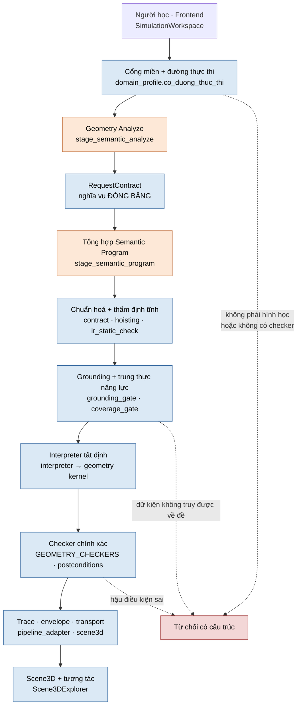
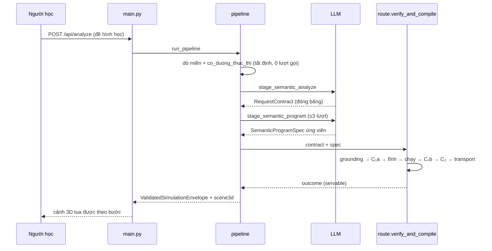

# THESIS_ARCHITECTURE — kiến trúc hệ thống đã đóng băng

> **Phạm vi tài liệu này.** Mô tả **hệ đang chạy** tại trạng thái
> `IMPLEMENTATION_FROZEN_FOR_THESIS` (2026-09-02). Viết từ mã nguồn đã đóng
> băng, không từ tài liệu cũ. Diễn giải bằng chứng (tuyên bố ↔ evidence ↔ giới
> hạn) thuộc **`docs/THESIS_READINESS.md`** — ở đây **không chép số benchmark**.
>
> Mọi đường dẫn dưới đây tồn tại trong repo tại bản đóng băng. Kiến trúc **cũ**
> (miền Tin học: catalog, DSL, 24 target) đã gỡ; nó chỉ được nhắc khi cần giải
> thích *vì sao* một ranh giới có hình dạng hiện tại.

---

## A. Ranh giới hệ thống

**Đầu vào:** một đề toán hình học không gian bằng tiếng Việt (Toán 11–12).

**Đầu ra:** một *mô phỏng 3D chạy được* — chuỗi bước dựng hình tất định, đại
lượng tính **chính xác** (hữu tỉ + căn thức), và một cảnh 3D tua được theo bước.

**Ngoài phạm vi, có chủ đích:**

- mọi miền không phải hình học không gian → `unsupported` + `out_of_scope`,
  **0 lượt gọi model**;
- khối **không lồi** và **mặt cong** (mặt cầu, trụ, nón) — nhân hình học không
  thi hành chúng;
- kéo–thả liên tục kiểu GeoGebra: nó phá song ánh `frame k ⇔ trace[k]`
  (bất biến #31), nên tương tác là **chọn và tua**, không phải kéo tự do;
- đánh giá tác động lên người học — chưa đo.

---

## B. Kiến trúc runtime



**Vùng cam = LLM. Vùng xanh = tất định. Vùng đỏ = fail-closed.**
Chỉ **hai** nút màu cam, và cả hai nằm trước khi có bất kỳ toạ độ nào.

Cổng vào HTTP: `backend/app/main.py` — `/api/analyze`, `/api/explain`,
`/api/health`, `/api/diagnostics/runtime`, `/api/diagnostics/semantic`.
Điều phối: `backend/app/ai/pipeline.py::run_pipeline` →
`_chay_duong_hinh_hoc`. Phán quyết tất định gom về **một cửa**:
`backend/app/simulation/semantic_program/route.py::verify_and_compile`.

---

## C. Ranh giới LLM ↔ tất định (R0)

Đây là **luận điểm** của đề tài, không phải một chi tiết kỹ thuật.

| | LLM sở hữu | Hệ tất định sở hữu |
|---|---|---|
| Ngôn ngữ | đọc đề, trích dữ kiện thành `RequestContract` | — |
| Chương trình | **tổng hợp** `SemanticProgramSpec` ứng viên | lược đồ, thẩm định tĩnh, chuẩn hoá |
| Dữ liệu | — | grounding: dữ kiện phải truy được về đề |
| Thực thi | — | interpreter + nhân hình học |
| Con số | — | toạ độ, khoảng cách, góc, thể tích — **chính xác** |
| Đúng/sai | — | 9 checker + hậu điều kiện |
| Hình ảnh | — | trace → khung hình → cảnh 3D |

Cách nói đúng: **LLM tổng hợp một chương trình ngữ nghĩa có cấu trúc; các tầng
tất định kiểm chứng, thực thi và dẫn xuất trace/cảnh 3D.**

Cách nói **sai** (và vì sao): *"LLM tạo hoạt hình"* — LLM không phát ra một
khung hình nào; *"LLM tính đáp án"* — mọi đại lượng do `simulation/geometry/`
tính bằng số học chính xác. Sau bước tổng hợp **không còn lượt gọi nào**;
`MAX_SEMANTIC_PROGRAM_ATTEMPTS = 3` chặn ngay ở call graph.

---

## D. Semantic Program — IR chạy được

`backend/app/simulation/semantic_program/contract.py` · `SPEC_VERSION = 1.0`.
Mô hình Pydantic là **nguồn**; JSON Schema sinh ra bằng
`scripts/export_semantic_program_schema.py` (ghi **hai bản**: `docs/schemas/`
và `frontend/src/simulations/domains/semantic/`, khoá byte-đối-byte bởi
`tests/semantic_program/test_schema_sync.py`).

Thẩm quyền kiểu nằm ở **một chỗ** — `ir_static_check.py`: `_CHU_KY` (chữ ký
biểu thức) · `_KIEU_DUNG` (phép dựng sinh ra gì) · `_TOAN_HANG_LENH` (ô toán
hạng nhận gì); phép đo ở `measure_contract.BANG_PHEP_DO`. Prompt, validator và
thẻ văn phạm (`grammar_card.py`) đều **dẫn xuất** từ đó — không bảng nào gõ tay.

Năng lực hiện tại (dẫn từ `runtime_identity()`, không chép tay — kiểm bằng
`GET /api/diagnostics/runtime`):

- **8 biểu thức** — `divide_segment`, `intersect_line_line`,
  `intersect_line_plane`, `intersect_plane_plane`, `midpoint`, `project_onto`,
  `translate`, `vector_from_points`;
- **6 câu lệnh dựng** — `construct_point`, `construct_line`, `construct_plane`,
  `construct_polygon`, `construct_section`, `construct_solid`;
- **4 phép đo** — `distance`, `angle_cos`, `angle_cos_sq`, `volume`;
- **9 nghĩa vụ có checker** — xem §F.

**Mọi toán hạng hình học là một TÊN.** Không có toạ độ thô trong IR: mô hình
viết `midpoint(of="AB")`, không viết `midpoint([1,2,3])`. Đây là chỗ ranh giới
R0 được thi hành bằng lược đồ chứ không bằng lời dặn. Hai cơ chế công thái
(`hoisting.py` nâng biểu thức lồng thành binding tạm;
`contract.canonical_geometry_name` bóc `{"kind":"var"}`) làm ô TÊN dễ viết
đúng mà **không** nới ranh giới — chúng cố ý không gộp làm một.

### Bài mới ≠ mã mới

Một bài toán mới **không đòi hỏi thay đổi mã nguồn** nếu nó biểu diễn được
bằng IR hiện có: LLM **kết hợp** các primitive tổng quát ở trên thành một
chương trình mới. Runtime đứng yên qua bốn wave đề mới, và
`PROBLEM_FAMILY_SPECIAL_CASES = 0` (quét AST mã sản phẩm) là bằng chứng không
có nhánh nào rẽ theo *dạng bài*.

Ba điều **không** được suy ra từ đó: hệ **không** hỗ trợ mọi bài hình học THPT;
hệ **không** tự mở rộng IR; mô hình **không** viết module mới cho dạng bài lạ.
Bài nằm ngoài IR bị **từ chối**, không được xấp xỉ.

---

## E. Nhân hình học chính xác

`backend/app/simulation/geometry/` — **bốn tầng một chiều**, không có cạnh ngược:

```
exact.py  ─→  predicates.py  ─→  kernel.py  ─→  measure.py
(Fraction,      (thuộc, song song,   (giao tuyến,    (khoảng cách,
 radical.py)     vuông góc, đồng      thiết diện       góc, thể tích)
                 phẳng)               section.py)
```

**Không có `float` trong miền hình học.** Số hữu tỉ dùng `Fraction`; căn thức
dùng `Radical` (`radical.py`). Đáp số ra đúng dạng `√3`, `3√89/5` — không phải
`1.7320508`. Đó là điều kiện để checker phán đúng/sai được, thay vì so sánh
trong một dung sai tự đặt.

Cầu nối IR ↔ nhân: `semantic_program/geometry_exec.py`.

**Oracle kiểm định cài ĐỘC LẬP** ở
`docs/evaluation/geometry/custodian/geometry_oracle.py` — cố ý dùng thuật toán
**khác** kernel. Một oracle chia chung mã với thứ nó kiểm thì nó chỉ xác nhận
mã đó nhất quán với chính nó.

---

## F. Thẩm định, grounding và trung thực năng lực

`route.verify_and_compile` chạy các cổng theo **thứ tự có ý nghĩa**:

1. **Grounding** (`grounding_gate.py`) — chương trình lấy dữ liệu ở đâu ra. Sai
   ở đây thì mọi kiểm định sau đều đang kiểm một bài *khác* với đề. Hỏng ⇒
   `INPUT_NOT_GROUNDED`.
2. **C₁a — phủ cấu trúc** (`coverage_gate.check_structural_coverage`) trước khi
   chạy: chương trình có *đường* tạo ra thứ đề hỏi không.
3. **Thẩm định tĩnh** (`ir_static_check.kiem_tinh`) ngay trước kernel — toán
   hạng chưa dựng, sai kiểu, tỉ lệ hỏng đều đọc được từ chính chương trình.
   Bắt ở đây thay vì chết ở runtime.
4. **Thực thi** (`interpreter.py`), có ngân sách.
5. **C₁b — phủ đã hiện thực** — witness có **thật sự** xuất hiện trong lượt
   chạy này không.
6. **Bất biến nguồn + C₂ hậu điều kiện** (`postconditions.py`) — server sở hữu.
7. **Transport** (`transport.py`) rồi **bề mặt học sinh**
   (`learner_surface.py`).

### Trung thực năng lực

C₁a phân biệt **hai** mức hỏng, và việc không gộp chúng là có chủ đích:

| mã | nghĩa | xử lý |
|---|---|---|
| `REQUESTED_OPERATION_UNCOVERED` | không có đường tạo witness | **chặn** |
| `SEMANTIC_VERIFICATION_UNAVAILABLE` | có đường, nhưng thiếu checker | **đi tiếp**, `servable = False` |

Gộp hai mức lại sẽ bóp hai tỉ lệ khác nhau của khoá luận thành một, và bóp một
cách câm: bài *chạy được nhưng chưa kiểm định được* sẽ bị khai là *không làm
được*. `servable` — chứ không phải `executable` — là thứ duy nhất quyết định có
phát canonical hay không.

**Chín checker tất định** (`geometry_obligations.GEOMETRY_CHECKERS`):
`point_on_line`, `point_on_plane`, `parallel`, `perpendicular`, `coplanar`,
`distance`, `angle`, `volume`, `section_matches`.

---

## G. Trace → Scene3D

Interpreter sinh **trace**: mỗi bước mang `memory_snapshot` ngữ nghĩa thuần.
`visual_adapter.py` dẫn xuất **khung hình** với song ánh **`frame k ⇔ trace[k]`**
(bất biến #31) — điều kiện để "tua tới bước 5" có nghĩa xác định. `pacer.py` sở
hữu ngân sách **trình bày**, tách hẳn ngân sách **thực thi**; gộp hai ngân sách
là bỏ mất một trong hai.

`scene3d.py` phát cảnh; bảng `RENDER_HINT` của nó khoá đồng bộ với
`frontend/src/simulations/domains/geometry/scene3d-model.ts::RENDER_KINDS`
(`tests/geometry/test_scene3d_ts_sync.py`). Thiếu một nhánh ở phía TS thì
renderer **im lặng bỏ qua** đối tượng — chế độ hỏng đã xảy ra thật, nên nó có
test khoá hai chiều.

Mọi vật dựng mang `producer`/`depends`: cảnh nói được *bước nào tạo ra nó* và
*nó phụ thuộc cái gì*. Không có đường ngược từ renderer về state.

---

## H. Tương tác phía frontend

`store.loadEnvelope` → `module.validateConfig` → `module.init` → state.
`SimulationWorkspace.tsx` gắn `Scene3DExplorer` khi envelope mang một `scene3d`
hợp lệ (`hopLeScene3D`) — mặt 3D **không** đi qua registry; registry chỉ giữ
`generic.semantic_program`, `simulation_id` duy nhất sản phẩm phát ra.

Renderer **chỉ đọc** state. Bố cục và camera thuộc renderer; ngữ nghĩa thuộc
engine — không bao giờ đảo. Mở lại một bài từ lịch sử đi thẳng vào engine tất
định với **0 lượt gọi AI** (bất biến #17).

Bề mặt học sinh nói tiếng Việt; định danh kỹ thuật (`simulation_id`,
reason_code, tên trường) **không được** lọt lên UI — khoá bởi
`components/ui-hygiene.test.ts`.

---

## I. Hành vi fail-closed

Hệ **không đoán**. Mỗi chỗ dừng đều trả một từ chối *có cấu trúc*: giai đoạn
dừng + `failure_category` + `ErrorCode` + thông điệp tiếng Việt cho người học.



**Đường từ chối** — ví dụ ca demo `n4`: chương trình trích dẫn một dữ kiện
**không có** trong `RequestContract`. Cổng grounding chặn *trước khi* thực thi,
trả `INPUT_NOT_GROUNDED` kèm danh sách trích dẫn không truy được. Người học
thấy một lời từ chối đọc được; hệ **không** dựng một cảnh minh hoạ cho đáp án
mà nó không chứng minh được. Ba biến thể fail-closed khác: sai miền
(`out_of_scope`, 0 lượt gọi) · đề không ánh xạ tới nghĩa vụ có checker
(`not_simulation_suitable`, 0 lượt gọi) · hậu điều kiện sai sau khi chạy.

`audit_demo_crash_surface.py` kiểm sáu biên và đo **0 đường ném ra ngoài**: mỗi
biên từ chối *đúng kiểu của nó*, không có biên nào thành lỗi 500.

---

## J. Phạm vi và giới hạn

Giới hạn đã chốt (chi tiết + bằng chứng: `docs/THESIS_READINESS.md` §4):

| giới hạn | trạng thái |
|---|---|
| `CONTROL_FLOW_DEFINITE_ASSIGNMENT` | **PARTIAL** |
| `ANALYZE_SOURCE_FACT_COMPLETENESS` | **PARTIAL** |
| `SECTION_VERTEX_INTERSECTION_GAP` | **OPEN** |
| chỉ khối **lồi**, không mặt cong | giới hạn phạm vi hiện tại |
| `CURRICULUM_SUPPORT` | **PARTIAL** — phủ một phần, có chủ đích |
| `LEARNER_IMPACT_NOT_EVALUATED` | **OPEN / ngoài phạm vi** |

Về `ANALYZE_SOURCE_FACT_COMPLETENESS`: quan sát được là **`n1` có 3 dữ kiện toạ
độ, `n2` có 4, `n3`/`n4` không có dữ kiện toạ độ nào** trong các lượt đã ghi.
Không kết luận *ngẫu nhiên*, *hệ thống*, *ổn định* hay *không ổn định* — độ ổn
định **không được đo**, và không được đo **vì quyết định phạm vi**
(`ANALYZE_STABILITY = NOT_MEASURED_BY_SCOPE_DECISION`).

Về `translate`: nó là **`CANONICAL_ERGONOMIC_PRIMITIVE`**, với
`PRE_EXTENSION_SEMANTIC_EXPRESSIBLE = YES` — nghĩa là mọi thứ nó viết được đã
biểu diễn được trước khi có nó. Nó giảm ma sát tổng hợp và ma sát lược đồ,
**không** mở thêm năng lực toán học nào. Đừng gọi nó là "năng lực hình học mới".

Về ca `n3`: **không dùng làm bằng chứng tính đúng ngữ nghĩa**, vì oracle số học
của nó không phân biệt được hai cách dựng khác nhau. Điểm số lịch sử giữ
nguyên, không hồi tố (`docs/THESIS_READINESS.md` §3).

---

## Tài liệu liên quan

| cần gì | đọc file nào |
|---|---|
| tuyên bố ↔ bằng chứng ↔ giới hạn | `docs/THESIS_READINESS.md` |
| kịch bản trình bày demo | `docs/THESIS_DEMO.md` |
| trạng thái vận hành cuối | `docs/CURRENT_STATE.md` §1a |
| module nào ở đâu, ai sở hữu gì | `docs/CODE_INDEX.md` §0b–§0d |
| bất biến đánh số + anti-pattern | `docs/ARCHITECTURE_MAP.md` §5, §8 |
| bằng chứng của các wave đã qua | `docs/evaluation/**` (đông cứng, không sửa) |
