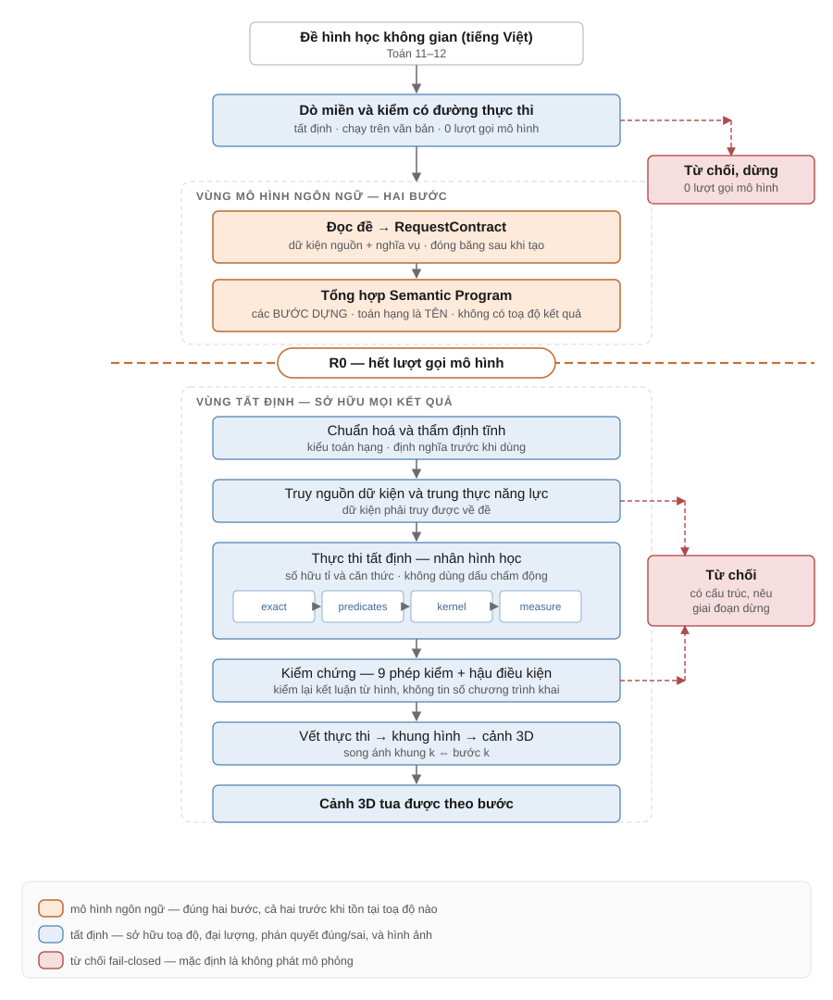
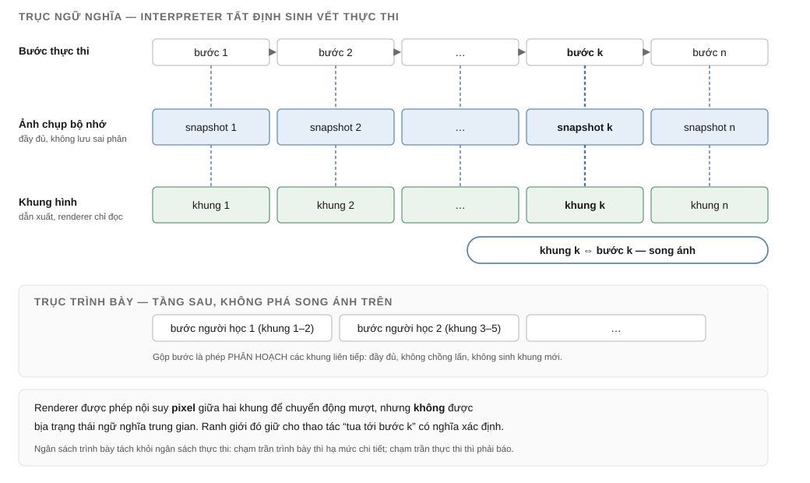
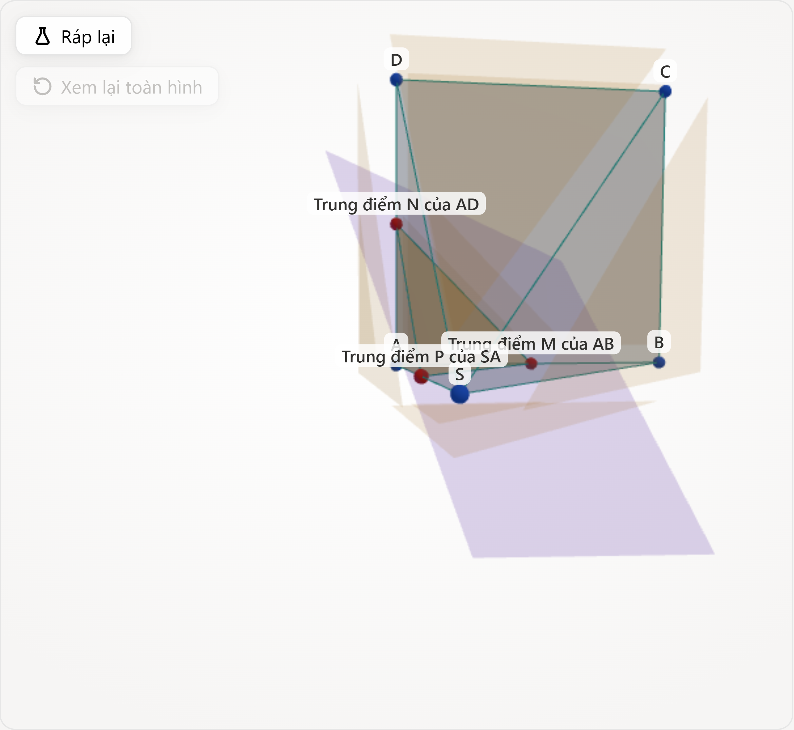
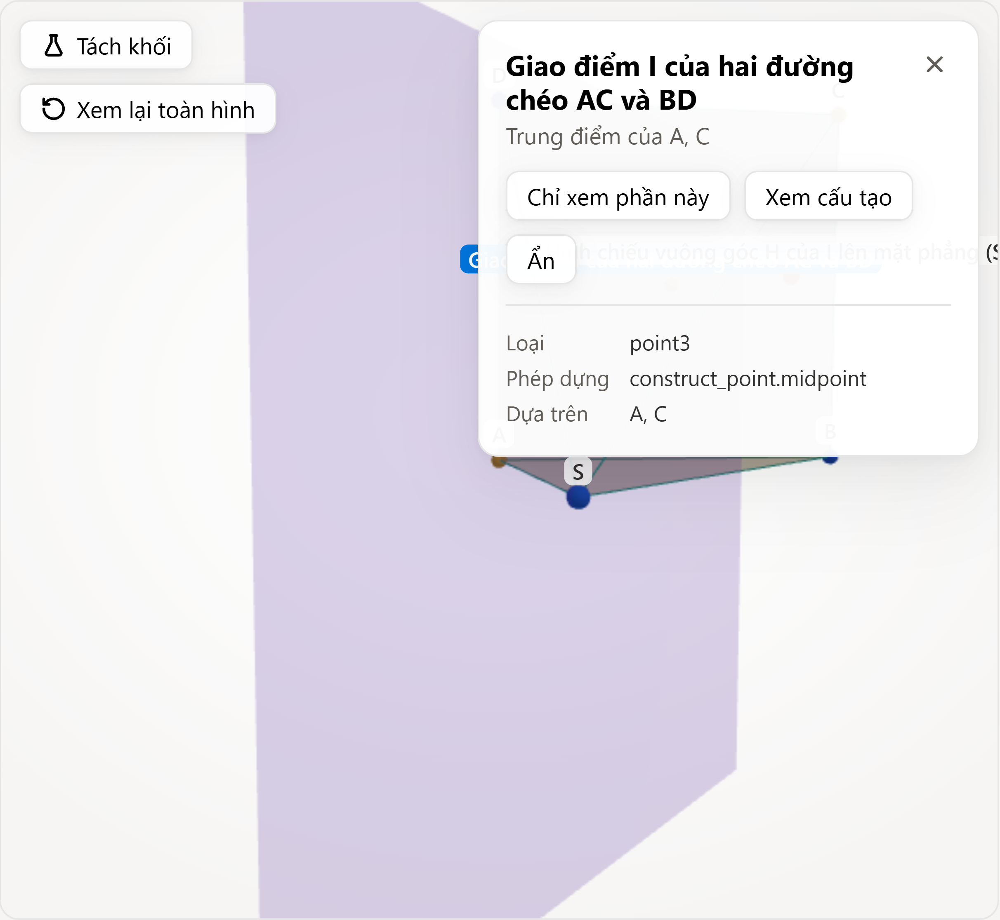
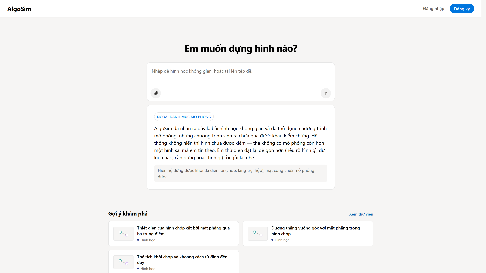
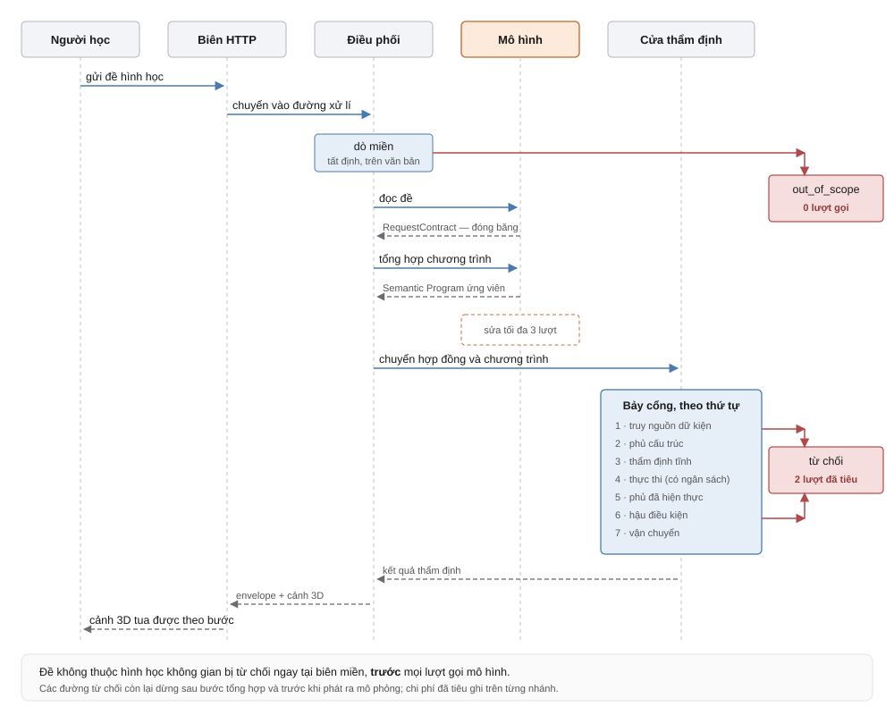
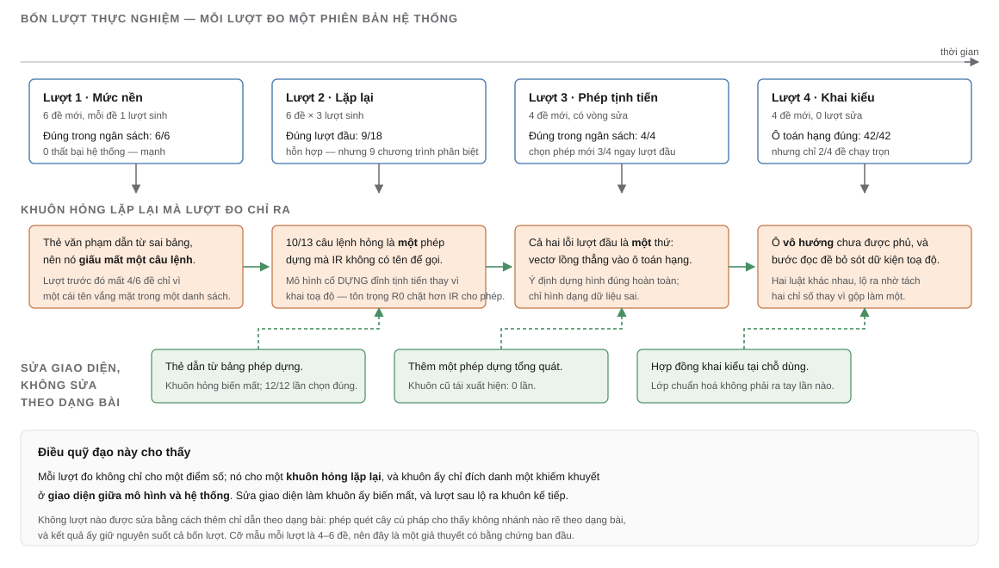
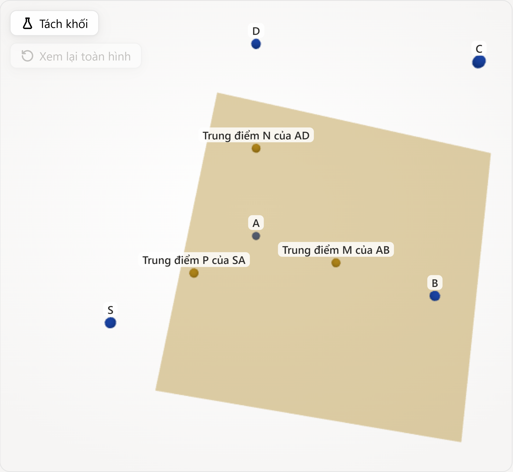
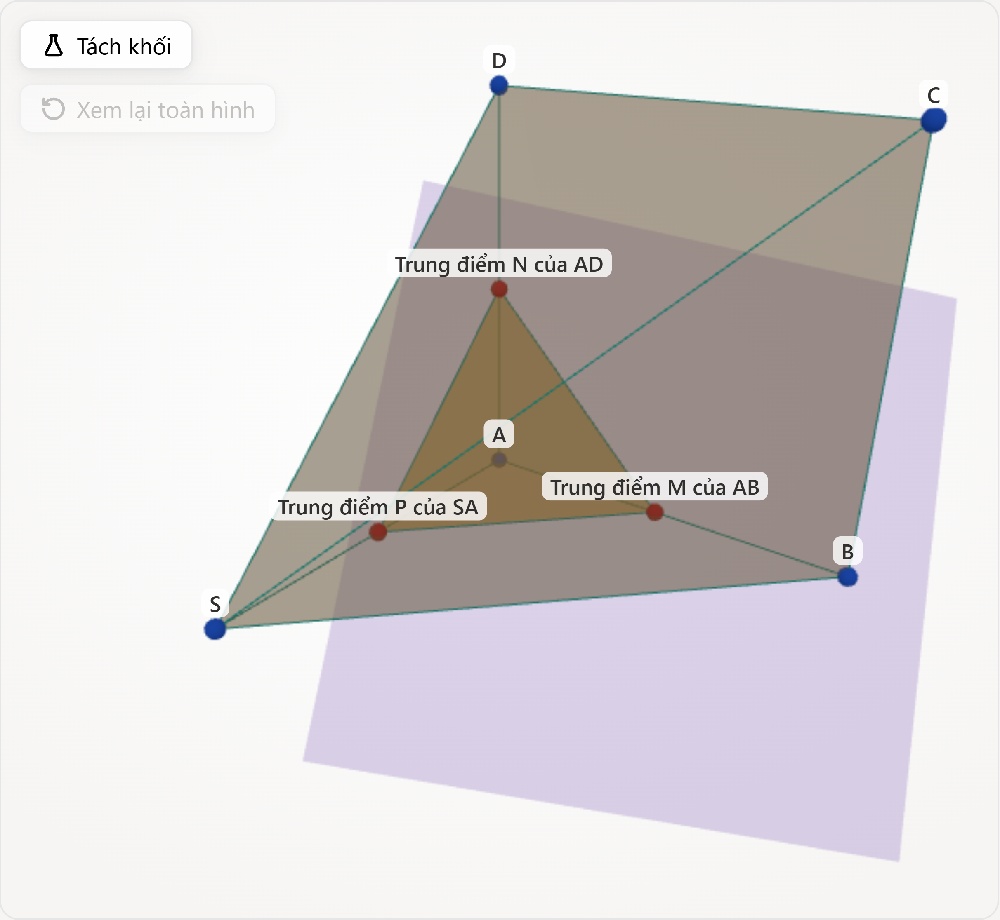

# KHOÁ LUẬN TỐT NGHIỆP

# Nghiên cứu và xây dựng hệ thống mô phỏng 3D hình học không gian

> **Trạng thái tài liệu.** Bản thảo nội dung, hoàn thiện văn phong ngày
> 2026-09-02, viết từ **mã nguồn đã đóng băng** và từ các bản ghi thực nghiệm đã
> niêm phong trong `docs/evaluation/`. Không có thực nghiệm mới, không có số liệu
> mới, không sửa mã sản phẩm trong quá trình soạn.
>
> Nội dung nghiên cứu đã đóng. Việc còn lại trước khi nộp — áp mẫu trình bày của
> trường, dựng hình, chụp màn hình — liệt kê ở
> `docs/THESIS_SUBMISSION_CHECKLIST.md`.
>
> **Thẩm quyền số liệu.** Mọi con số trong bản thảo này trích từ
> `docs/THESIS_READINESS.md` và các bản ghi mà tài liệu đó nêu tên. Khi bản thảo
> và bản ghi lệch nhau, **bản ghi thắng**.
>
> **Trích dẫn.** Kiểu **tác giả–năm**, tạm thời — kho chưa có quy định kiểu trích
> dẫn của trường, nên đây **không** phải tuyên bố APA/IEEE. Metadata đầy đủ:
> `docs/THESIS_REFERENCES.md`. Bảng *trích dẫn nào chống đỡ câu nào*:
> `docs/THESIS_CITATION_MATRIX.md`.
>
> **Hình và bảng.** Chú thích hình được viết dạng nghiêng ngay dưới vị trí hình;
> bốn hình cần ảnh chụp màn hình còn ở dạng chú thích chờ. Kế hoạch dựng hình,
> đặc tả chụp và chú thích dự kiến: `docs/THESIS_FIGURE_CAPTURE_PLAN.md`.
> Danh mục đầy đủ ở phần cuối bản thảo.

---

## MỤC LỤC

- [TÓM TẮT](#tóm-tắt)
- [ABSTRACT](#abstract)
- [DANH MỤC VIẾT TẮT VÀ THUẬT NGỮ](#danh-mục-viết-tắt-và-thuật-ngữ)
- [MỞ ĐẦU](#mở-đầu)
- [CHƯƠNG 1. TỔNG QUAN VÀ BÀI TOÁN NGHIÊN CỨU](#chương-1-tổng-quan-và-bài-toán-nghiên-cứu)
- [CHƯƠNG 2. CƠ SỞ LÝ THUYẾT VÀ CÔNG NGHỆ](#chương-2-cơ-sở-lý-thuyết-và-công-nghệ)
- [CHƯƠNG 3. PHÂN TÍCH VÀ THIẾT KẾ HỆ THỐNG](#chương-3-phân-tích-và-thiết-kế-hệ-thống)
- [CHƯƠNG 4. XÂY DỰNG VÀ THỰC NGHIỆM HỆ THỐNG](#chương-4-xây-dựng-và-thực-nghiệm-hệ-thống)
- [CHƯƠNG 5. KẾT LUẬN VÀ HƯỚNG PHÁT TRIỂN](#chương-5-kết-luận-và-hướng-phát-triển)
- [DANH MỤC HÌNH VÀ BẢNG](#danh-mục-hình-và-bảng)
- [PHỤ LỤC](#phụ-lục)

---

# TÓM TẮT

Hình học không gian là nội dung khó của chương trình Toán phổ thông, với một đặc
điểm riêng: kết luận phụ thuộc vào cấu hình ba chiều trong khi phương tiện trình
bày thông thường lại là hai chiều. Mô phỏng ba chiều tương tác có thể gỡ nút thắt
ấy, nhưng mỗi mô phỏng phải được dựng thủ công cho từng bài. Mô hình ngôn ngữ lớn
đọc được đề toán viết tự nhiên; song nếu để mô hình quyết định toàn bộ nội dung
chạy thì sản phẩm thu được không kiểm chứng được, và trong dạy học một mô phỏng
sai được trình bày thuyết phục tạo rủi ro củng cố hiểu sai.

Khoá luận xây dựng một hệ thống nhận đề hình học không gian bằng tiếng Việt và
trả về một mô phỏng ba chiều đã được kiểm chứng, theo một ranh giới kiến trúc
tường minh: mô hình ngôn ngữ đọc đề và tổng hợp một *chương trình ngữ nghĩa* có
cấu trúc, còn các tầng tất định kiểm chứng, thực thi và dẫn xuất biểu diễn trực
quan. Ranh giới này được cưỡng chế bằng ràng buộc kiểu của lược đồ dữ liệu chứ
không bằng chỉ dẫn ngôn ngữ: mọi toán hạng hình học trong biểu diễn trung gian là
**tên** của một đối tượng đã dựng, nên mô hình không thể phát ra một toạ độ kết
quả; sau bước tổng hợp, hệ thống không gọi mô hình thêm lần nào. Nhân hình học
dùng số học chính xác trên số hữu tỉ và căn thức thay cho xấp xỉ dấu chấm động,
nhờ đó các vị ngữ hình học quyết định được và kết luận kiểm chứng được bằng chín
phép kiểm tất định. Cảnh ba chiều và dòng thời gian được dẫn xuất từ vết thực
thi, giữ song ánh giữa khung hình thứ *k* và bước thực thi thứ *k*.

Bốn lượt thực nghiệm có niêm phong trước cho thấy mô hình tổng hợp được chương
trình hợp lệ cho các đề chưa từng gặp, và một bài toán mới không đòi hỏi thay đổi
mã nguồn nếu nó biểu diễn được bằng biểu diễn trung gian hiện có. Một quan sát có
tính phương pháp: phần lớn thất bại tổng hợp đo được là khiếm khuyết ở **giao
diện giữa mô hình và hệ thống**, không phải giới hạn năng lực của mô hình.

Phạm vi được khai rõ: chỉ khối đa diện lồi, không mặt cong; độ phủ chương trình
là một phần, có chủ đích; cỡ mẫu mỗi lượt thực nghiệm nhỏ (4–6 đề); và tác động
lên người học **chưa được đánh giá**.

**Từ khoá:** hình học không gian; mô phỏng 3D trong giáo dục; mô hình ngôn ngữ
lớn; biểu diễn trung gian; thực thi tất định; số học chính xác; kiểm chứng
fail-closed.

---

# ABSTRACT

Solid geometry is among the harder topics in secondary mathematics, and its
difficulty has a specific character: conclusions depend on a three-dimensional
configuration while the usual means of presentation are two-dimensional.
Interactive 3D simulation can address this, but each simulation must be
constructed by hand for each problem. Large language models can read
natural-language problem statements; however, letting a model decide the entire
runtime content yields a system that cannot be verified — and in an educational
setting, a plausible-looking but incorrect simulation risks reinforcing
misconceptions.

This thesis builds a system that takes a Vietnamese-language solid geometry
problem and returns a verified 3D simulation, under an explicit architectural
boundary: **the language model reads the problem and synthesises a structured
semantic program; deterministic layers verify, execute, and derive the visual
representation.** The boundary is enforced by the type constraints of the data
schema rather than by prompt instructions: every geometric operand in the
intermediate representation is the **name** of an already-constructed object, so
the model cannot emit a resulting coordinate. After synthesis, the system makes
no further model calls. The geometry kernel uses exact arithmetic over rationals
and radicals instead of floating-point approximation, which makes geometric
predicates decidable and lets nine deterministic checkers verify the conclusion.
The 3D scene and its timeline are derived entirely from the execution trace,
preserving a bijection between frame *k* and execution step *k*.

Four pre-registered experiments show that the model synthesises valid programs
for previously unseen problems, and that a new problem requires no new source
code provided it is expressible in the existing intermediate representation. One
methodological observation: most of the measured synthesis failures were
**defects in the interface between the model and the system**, not limits of the
model's capability.

Scope is stated explicitly: convex polyhedra only, no curved surfaces; curriculum
coverage is deliberately partial; sample sizes are small (4–6 problems per
experiment); and learner impact has **not been evaluated**.

**Keywords:** solid geometry; 3D educational simulation; large language models;
intermediate representation; deterministic execution; exact arithmetic;
fail-closed verification.

---

# DANH MỤC VIẾT TẮT VÀ THUẬT NGỮ

| Viết tắt / thuật ngữ | Nghĩa |
|---|---|
| **LLM** | *Large Language Model* — mô hình ngôn ngữ lớn |
| **IR** | *Intermediate Representation* — biểu diễn trung gian |
| **R0** | Ranh giới giữa vùng mô hình ngôn ngữ và vùng tất định (§3.2) |
| **Semantic Program** | Chương trình ngữ nghĩa — biểu diễn trung gian chạy được của đề tài (§3.4) |
| **RequestContract** | Hợp đồng yêu cầu — dữ kiện và nghĩa vụ trích từ đề, đóng băng sau khi tạo (§3.3) |
| **grounding** | Truy nguồn dữ kiện — kiểm rằng mọi dữ kiện chương trình dùng đều truy được về đề (§3.6) |
| **checker** | Phép kiểm tất định cho một nghĩa vụ của đề (§3.6.3) |
| **trace** | Vết thực thi — dãy trạng thái mà chương trình đi qua (§2.6) |
| **Scene3D** | Cảnh ba chiều dẫn xuất từ vết thực thi (§3.7) |
| **fail-closed** | Mặc định từ chối khi không xác định được tính hợp lệ (§2.8) |
| **API** | Giao diện lập trình ứng dụng |
| **JSON Schema** | Lược đồ mô tả cấu trúc dữ liệu JSON |
| **3D** | Ba chiều |

> Danh mục chỉ giữ những mục **xuất hiện nhiều lần** trong luận văn. Các định
> danh kỹ thuật của mã nguồn (tên hàm, tên tệp, mã lỗi) không nằm ở đây; chúng
> chỉ xuất hiện khi luận văn nói về cài đặt, và được đặt trong nền mã.

---

# MỞ ĐẦU

## 1. Lý do chọn đề tài

Hình học không gian là một trong những nội dung khó nhất của chương trình Toán
phổ thông, và cái khó của nó có một đặc điểm riêng: **học sinh phải suy luận về
một cấu hình ba chiều trong khi mọi phương tiện trình bày đều là hai chiều.**
Hình vẽ trên bảng, trong sách giáo khoa, trên giấy nháp đều là *hình biểu diễn*
— một phép chiếu đã làm mất thông tin. Hai đường thẳng chéo nhau trông như cắt
nhau; một góc vuông trong không gian trông như góc tù trên giấy. Người học phải
tự dựng lại chiều thứ ba trong đầu trước khi bắt đầu suy luận. Năng lực hình
dung không gian là một kỹ năng riêng, và thiếu nó thì việc học toán trong môi
trường ba chiều trở nên khó khăn (Medina Herrera và cs., 2024).

Một mô phỏng ba chiều tương tác, về nguyên tắc, gỡ đúng nút thắt đó: cấu hình
được dựng thật trong không gian, người học xoay nó và nhìn từ hướng khác, và
quan hệ hình học trở thành thứ quan sát được thay vì thứ phải tưởng tượng. Đây
không phải một phỏng đoán: một phân tích tổng hợp 29 nghiên cứu trên 2.111 học
sinh cho thấy dạy học có hỗ trợ của phần mềm hình học động đạt hiệu quả cao hơn
rõ rệt so với dạy học truyền thống (Juandi và cs., 2021).

Nhưng có một khoảng cách giữa nguyên tắc ấy và thực tế lớp học: **mô phỏng phải
được tạo ra**. Các công cụ hình học động hiện có đòi người dùng tự dựng hình
bằng thao tác; muốn mô phỏng một bài trong đề, giáo viên phải đọc đề, dịch nó
sang một chuỗi thao tác dựng, rồi thực hiện chuỗi thao tác ấy. Công việc này lặp
lại cho từng bài — và đó là một chi phí thật, dù khoá luận này **không** có số
liệu khảo sát về tần suất sử dụng thực tế trong trường phổ thông Việt Nam.

Các mô hình ngôn ngữ lớn (LLM) hiện nay đọc và hiểu được đề toán viết bằng ngôn
ngữ tự nhiên. Điều đó gợi ra một khả năng hiển nhiên: để mô hình đọc đề rồi tự
sinh mô phỏng. Và chính ở đây xuất hiện **rủi ro trung tâm của đề tài**.

Nếu để mô hình ngôn ngữ tự quyết định toàn bộ nội dung chạy — toạ độ, kết quả
đo, chuỗi hoạt hình — thì hệ thống thu được là một hệ **không kiểm chứng được**.
Mô hình có thể phát ra một cảnh 3D đẹp và một đáp số sai, và người học không có
cách nào phân biệt.

Điều làm rủi ro ấy nghiêm trọng không phải là xác suất sai, mà là **cách người
dùng phản ứng với đầu ra sai**. Tổng quan khoảng 60 công trình về *lệ thuộc quá
mức vào AI* mô tả hiện tượng này rất gọn: nó xảy ra khi người dùng bắt đầu chấp
nhận những đầu ra sai của AI, giảm việc kiểm chứng độc lập, và do đó thừa hưởng
luôn lỗi của hệ thống (Passi & Vorvoreanu, 2022). Trong lớp học, người kiểm
chứng lại chính là người chưa nắm vững nội dung — nên một mô phỏng sai được
trình bày thuyết phục **tạo rủi ro hình thành hoặc củng cố hiểu sai**, chứ không
đơn thuần là một thiếu sót kỹ thuật.

Đề tài này chọn cách khác. **Mô hình ngôn ngữ không sở hữu kết quả.** Nó đọc đề
và viết ra một *chương trình dựng hình có cấu trúc*; toàn bộ phần tính toán,
kiểm chứng và hiển thị do các tầng tất định đảm nhiệm, dùng số học chính xác
thay cho xấp xỉ dấu chấm động. Ranh giới ấy — gọi là **R0** trong suốt tài liệu này — vừa là quyết
định kỹ thuật vừa là luận điểm nghiên cứu.

## 2. Vấn đề cần giải quyết

Bài toán được phát biểu như sau:

> Cho một đề hình học không gian viết bằng tiếng Việt (chương trình Toán 11–12),
> hãy sinh ra một **mô phỏng 3D chạy được và kiểm chứng được**: chuỗi bước dựng
> hình tất định, các đại lượng tính bằng số học chính xác, và một cảnh ba chiều
> tua được theo từng bước — sao cho không giai đoạn nào của quá trình để mô hình
> ngôn ngữ quyết định một con số hay một kết luận đúng/sai.

Ba ràng buộc đi kèm, và cả ba đều là ràng buộc *có chủ đích*:

1. **Không làm tròn.** Đáp số phải giữ dạng chính xác (`√3`, `3√89/5`), không
   phải xấp xỉ thập phân. Đây là điều kiện để có thể kiểm chứng đúng/sai bằng
   một phép so bằng, thay vì bằng một dung sai tự đặt.
2. **Không xấp xỉ hình.** Đề vượt khả năng biểu đạt của hệ phải bị **từ chối có
   địa chỉ**, không được thay bằng một hình gần giống.
3. **Không có mã riêng cho từng dạng bài.** Nếu mỗi dạng bài cần một mô-đun
   riêng thì hệ thống chỉ là một thư viện mô phỏng viết sẵn, và luận điểm nghiên
   cứu không còn.

## 3. Mục tiêu nghiên cứu

**Mục tiêu tổng quát.** Xây dựng và đánh giá một kiến trúc trong đó mô hình ngôn
ngữ *tổng hợp một chương trình ngữ nghĩa có cấu trúc*, còn hệ tất định *kiểm
chứng, thực thi và dẫn xuất biểu diễn trực quan*.

**Mục tiêu cụ thể.**

1. Thiết kế một **biểu diễn trung gian (IR)** cho bài toán hình học không gian —
   gọi là *Semantic Program* — đủ để diễn đạt các bước dựng hình và phép đo, và
   đủ chặt để không cho phép mô hình nhúng kết quả vào đầu vào.
2. Cài đặt một **nhân hình học tất định** tính toán trên số hữu tỉ và căn thức,
   không dùng số dấu chấm động trong miền hình học.
3. Xây dựng các **tầng thẩm định fail-closed**: truy nguồn dữ kiện (grounding),
   thẩm định tĩnh IR, kiểm chứng bằng checker tất định, và khai báo trung thực
   khi thiếu năng lực.
4. Dẫn xuất **cảnh 3D và dòng thời gian** từ vết thực thi, giữ song ánh
   giữa khung hình thứ *k* và bước thực thi thứ *k*.
5. **Đánh giá thực nghiệm** khả năng tổng hợp của mô hình trên các đề chưa từng
   thấy, và đo tính tất định của phần còn lại bằng bộ kiểm thử hồi quy.

## 4. Đối tượng và phạm vi nghiên cứu

**Đối tượng nghiên cứu:** kiến trúc phần mềm cho việc sinh mô phỏng giáo dục từ
ngôn ngữ tự nhiên, với ranh giới tường minh giữa thành phần xác suất (LLM) và
thành phần tất định (engine).

**Phạm vi nội dung:** hình học không gian trong chương trình Toán 11–12 — quan
hệ song song và vuông góc, giao tuyến, thiết diện, khoảng cách, góc, thể tích.

**Phạm vi được khai báo là NGOÀI, có chủ đích:**

| ngoài phạm vi | lý do |
|---|---|
| mặt cong (cầu, trụ, nón) | nhân hình học dựng trên đa diện và số hữu tỉ; xấp xỉ bằng đa diện là nói dối về đáp số |
| khối không lồi | ngoài phạm vi `kernel`/`section` hiện tại |
| quỹ tích, phương trình mặt phẳng/đường thẳng/mặt cầu | chưa có primitive tương ứng; hệ không đoán |
| kéo–thả liên tục kiểu phần mềm hình học động | phá song ánh `khung k ⇔ bước k`; tương tác ở đây là **chọn, tách khối, tua bước** |
| mọi miền không phải hình học không gian | từ chối ở biên, **0 lượt gọi mô hình** |
| đánh giá tác động lên người học | chưa thực hiện; khai rõ là ngoài phạm vi |

Bốn dòng cuối bảng đáng chú ý: chúng **không phải là thiếu sót cài đặt** mà là
biên của phương pháp, và việc khai chúng ra là một phần của luận điểm về tính
trung thực năng lực.

## 5. Phương pháp nghiên cứu

- **Nghiên cứu thiết kế (design research).** Kiến trúc được phát triển qua nhiều
  vòng: đặt ràng buộc → cài đặt → đo → đọc khuôn hỏng → sửa *giao diện* chứ không
  sửa từng ca. Chương 4 trình bày bốn vòng đo có niêm phong.
- **Kiểm thử tất định làm nền.** Toàn bộ phần không phải LLM được khoá bằng bộ
  kiểm thử hồi quy chạy offline, **0 lượt gọi mô hình**.
- **Thực nghiệm có niêm phong trước.** Mỗi lượt đo LLM đều: niêm phong bộ đề và
  ngưỡng phân loại **trước** khi gọi mô hình; lưu toàn bộ bản ghi, kể cả của lượt
  thất bại; không sửa mã nguồn hay chỉ dẫn cho mô hình giữa các ca trong cùng một
  lượt.
- **Oracle độc lập.** Bộ kiểm định đáp số được cài **bằng thuật toán khác** với
  nhân hình học, để một lỗi chung không tự xác nhận chính nó.

## 6. Đóng góp chính

1. Một **kiến trúc tách bạch** giữa vùng LLM và vùng tất định, trong đó mô hình
   không phát ra một toạ độ kết quả nào — ràng buộc được cưỡng chế bằng **lược
   đồ dữ liệu**, không bằng lời dặn trong chỉ dẫn cho mô hình.
2. **Semantic Program** — một IR chạy được cho hình học không gian, với toán hạng
   là *tên* của vật đã dựng, có xuất xứ (`producer`/`depends`) và có kiểm chứng.
3. Một **biên thẩm định có kiểu và fail-closed**: grounding → phủ cấu trúc →
   thẩm định tĩnh → thực thi → phủ đã hiện thực → hậu điều kiện.
4. **Nhân hình học dùng số học chính xác** trên số hữu tỉ và căn thức, không dùng
   `float` trong miền hình học.
5. **Cảnh 3D dẫn xuất từ vết thực thi**, giữ song ánh khung ⇔ bước.
6. Cơ chế **trung thực năng lực**: phân biệt *không làm được* với *làm được
   nhưng chưa kiểm chứng được*, thay vì gộp hai thứ thành một lời từ chối.
7. **Bằng chứng thực nghiệm** rằng bài toán mới nằm trong IR có thể được tổng hợp
   bằng **tổ hợp** primitive, không cần mô-đun theo dạng bài.

Đóng góp 1–6 là đóng góp *thiết kế và cài đặt*; đóng góp 7 là đóng góp *thực
nghiệm*, và phạm vi hiệu lực của nó bị giới hạn bởi cỡ mẫu — Chương 4 nói rõ.

## 7. Cấu trúc khoá luận

**Chương 1** đặt bài toán và phân tích vì sao hướng "để LLM sinh trực tiếp" là
hướng sai với mục tiêu giáo dục. **Chương 2** trình bày cơ sở lý thuyết và công
nghệ, mỗi khái niệm gắn với một quyết định thiết kế cụ thể ở Chương 3.
**Chương 3** là chương trọng tâm: kiến trúc, ranh giới R0, Semantic Program,
nhân hình học, thẩm định, và đường dẫn xuất cảnh 3D. **Chương 4** trình bày cài
đặt và bốn lượt thực nghiệm có niêm phong, cùng bộ bằng chứng tất định.
**Chương 5** tổng kết đóng góp, khai báo giới hạn và nêu hướng phát triển.

---

# CHƯƠNG 1. TỔNG QUAN VÀ BÀI TOÁN NGHIÊN CỨU

## 1.1. Bài toán mô phỏng hình học không gian trong dạy học

Nội dung hình học không gian ở Toán 11–12 xoay quanh một số nhóm câu hỏi ổn
định: xác định giao tuyến hai mặt phẳng, dựng thiết diện của một khối bởi một
mặt phẳng, chứng minh quan hệ song song hoặc vuông góc, tính khoảng cách (điểm
đến đường, điểm đến mặt, hai đường chéo nhau), tính góc (đường–đường, đường–mặt,
mặt–mặt) và tính thể tích khối đa diện.

Đặc điểm chung của các nhóm này: **kết luận phụ thuộc vào cấu hình ba chiều, còn
phương tiện trình bày lại là hai chiều.** Trên hình biểu diễn, quan hệ vuông góc
không nhìn thấy được, hai đường chéo nhau vẽ ra như cắt nhau, và tỉ lệ bị bóp
méo bởi phép chiếu. Người học phải liên tục dịch qua lại giữa hình vẽ phẳng và
cấu hình không gian mà nó đại diện — tức phải huy động năng lực hình dung không
gian, thứ mà nghiên cứu về giáo dục toán xếp thành một kỹ năng riêng và ghi nhận
là chỗ người học thiếu hụt khi làm việc trong môi trường ba chiều (Medina Herrera
và cs., 2024).

⚠️ Cần đọc đúng phạm vi của nguồn vừa dẫn: mẫu nghiên cứu của nó là **sinh viên
kỹ thuật**, không phải học sinh THPT Việt Nam. Nó chống đỡ cho nhận định rằng
*khó khăn hình dung không gian là có thật và đã được nghiên cứu*, không chống đỡ
một tuyên bố định lượng về học sinh lớp 11–12 trong nước.

## 1.2. Khó khăn của biểu diễn ba chiều

Có thể tách khó khăn thành ba lớp, và chúng cần được xử lý bằng ba cơ chế khác
nhau:

1. **Khó khăn tri giác.** Một hình chiếu tĩnh không đủ để khôi phục cấu hình gốc.
   Cách gỡ: cho phép **xoay** và **nhìn từ nhiều hướng**.
2. **Khó khăn về cấu trúc.** Bài toán hình học không gian là một *chuỗi dựng có
   phụ thuộc*: điểm này là trung điểm của cạnh kia, mặt phẳng ấy đi qua ba điểm
   đã dựng. Một hình tĩnh — dù ba chiều — không kể được thứ tự và quan hệ phụ
   thuộc ấy. Cách gỡ: **dựng theo bước**, và cho biết mỗi vật do bước nào sinh ra
   và phụ thuộc vào cái gì.
3. **Khó khăn về tính đúng đắn.** Người học không có cách kiểm tra một mô phỏng
   được đưa cho mình. Cách gỡ: mô phỏng phải **được hệ thống kiểm chứng** trước
   khi trình bày, và phải **từ chối** khi không kiểm chứng được.

Ba lớp này ánh xạ trực tiếp sang ba nhóm quyết định thiết kế ở Chương 3: cảnh 3D
tương tác (§3.7), chuỗi bước có xuất xứ (§3.4), và biên thẩm định fail-closed
(§3.6).

## 1.3. Vai trò của mô hình ngôn ngữ trong việc hiểu đề

Điều mà các mô hình ngôn ngữ hiện nay làm tốt và các phương pháp hình thức trước
đó làm kém là **đọc một đề toán viết tự nhiên**: nhận ra "hình chóp S.ABCD có
đáy là hình vuông cạnh a, SA vuông góc với đáy" mô tả một cấu hình gì, và câu
hỏi "tính khoảng cách từ B đến mặt phẳng (SCD)" đòi đại lượng nào.

Nhận định này có chỗ dựa trong tài liệu, và chỗ dựa ấy đến kèm một vế thứ hai
quan trọng không kém. Gao và cộng sự (2023) mô tả mô hình ngôn ngữ là **giỏi
phân rã bài theo từng bước**, nhưng đồng thời ghi nhận rằng chúng *"thường mắc
lỗi lôgic và số học ở phần giải, ngay cả khi bài đã được phân rã đúng"*. Nói
cách khác: năng lực **đọc và phân rã** thì có, năng lực **tính đúng** thì không
có bảo đảm.

Đây là một năng lực **ngôn ngữ**, không phải năng lực **hình học**. Đề tài này
dựa vào đúng năng lực ấy và chỉ năng lực ấy — và §1.4 cho thấy vì sao sự phân
tách ấy quyết định toàn bộ kiến trúc.

## 1.4. Vì sao không để mô hình sinh trực tiếp kết quả hoặc hoạt hình

Có ba cách hình dung việc dùng LLM cho bài toán này. Hai cách đầu bị loại, và lý
do loại chính là nội dung nghiên cứu.

**Cách A — mô hình sinh thẳng đáp số.** Loại vì không kiểm chứng được. Với một
đề hình học, đáp số là một biểu thức; không có cách nào phân biệt một đáp số
đúng với một đáp số sai trông hợp lý, nếu không tự giải lại bài toán. Và nếu hệ
thống đã tự giải lại được thì nó không cần mô hình để trả lời.

Tài liệu cũng cho thấy đây không phải một lo ngại lý thuyết. Mirzadeh và cộng sự
(2025) xây một bộ đo sinh từ khuôn mẫu ký hiệu và đo được ba hiện tượng trên các
mô hình hiện đại: đầu ra **dao động rõ rệt** giữa các biến thể của cùng một câu
hỏi khi chỉ đổi giá trị số; hiệu năng **giảm** khi số mệnh đề của bài tăng; và
thêm **một** mệnh đề trông có liên quan nhưng không tham gia chuỗi suy luận làm
hiệu năng giảm **tới 65%**. Kết quả ấy đo trên bài toán lời văn số học, không
phải hình học không gian — nhưng nó đủ để nói rằng đáp số do mô hình phát ra
**không đi kèm bảo đảm hình thức nào**.

**Cách B — mô hình sinh thẳng cảnh 3D hoặc chuỗi hoạt hình.** Loại vì hai lý do
độc lập:

- *Tính đúng đắn.* Toạ độ do mô hình phát ra không có gì bảo đảm thoả các ràng
  buộc của đề. Một hình chóp "trông đúng" có thể có đáy không phẳng, cạnh bên
  không vuông góc với đáy. Sai lệch ấy không lộ ra trên màn hình.
- *Tính giáo dục.* Một chuỗi khung hình không mang cấu trúc phụ thuộc. Người học
  thấy hình biến đổi nhưng không biết bước nào tạo ra vật nào — tức mất đúng lớp
  khó khăn thứ hai ở §1.2.

**Cách C — mô hình sinh một *chương trình dựng hình*, hệ tất định thực thi.** Đây
là cách được chọn. Mô hình phát ra thứ nó giỏi (dịch đề sang cấu trúc), còn máy
làm thứ máy giỏi (tính chính xác và kiểm chứng).

Quan sát then chốt biện minh cho cách C: **một chương trình dựng hình có thể
kiểm chứng được, còn một đáp số hay một cảnh 3D thì không.** Chương trình khai
tường minh nó dựng gì từ gì; hệ thống có thể chạy lại từ đầu, kiểm mỗi bước, và
đối chiếu kết luận cuối bằng một bộ kiểm định độc lập.

**Cách C không phải phát minh của khoá luận này**, và cần nói rõ điều đó ngay từ
đây. Gao và cộng sự (2023) đã đề xuất đúng nguyên tắc ấy dưới tên *Program-aided
Language Models*: để mô hình đọc đề ngôn ngữ tự nhiên và sinh **chương trình**
làm bước suy luận trung gian, rồi giao bước **giải** cho một runtime — trong
trường hợp của họ là trình thông dịch Python. Cái mà khoá luận này đóng góp nằm
ở chỗ khác: **chương trình ấy là gì** khi miền bài toán là hình học không gian,
và **những tầng nào phải đứng giữa** chương trình và người học. Chương 5 §5.2
phân tách rõ phần đã biết với phần đề tài thêm vào.

## 1.5. Nhu cầu về một biểu diễn trung gian

Cách C đòi một **biểu diễn trung gian** giữa đề bằng ngôn ngữ tự nhiên và cảnh
3D chạy được. Biểu diễn ấy phải đồng thời thoả bốn yêu cầu, và chúng kéo nhau
theo hai hướng ngược nhau:

| yêu cầu | hệ quả thiết kế |
|---|---|
| **mô hình viết được** | từ vựng nhỏ, cấu trúc đều, khai kiểu ngay tại chỗ dùng |
| **máy thực thi được** | ngữ nghĩa toán học xác định cho mỗi phép |
| **kiểm chứng được** | mỗi nghĩa vụ của đề gắn với một checker tất định |
| **không cho nhét kết quả vào đầu vào** | toán hạng hình học là **tên**, không phải toạ độ |

Yêu cầu thứ nhất kéo về phía *dễ viết*; yêu cầu thứ tư kéo về phía *chặt*. Phần
lớn công việc thiết kế của đề tài nằm ở chỗ giải quyết căng thẳng này, và Chương
4 cho thấy nó được giải bằng đo đạc chứ không bằng phỏng đoán: hai trong bốn
lượt thực nghiệm sinh ra trực tiếp từ việc đọc khuôn hỏng của lượt trước.

## 1.6. Bài toán mà đề tài lựa chọn — phát biểu đầy đủ

**Đầu vào:** một đề hình học không gian bằng tiếng Việt, Toán 11–12.

**Đầu ra, khi thành công:** một mô phỏng 3D chạy được gồm (i) chuỗi bước dựng
hình tất định, (ii) các đại lượng được hỏi, tính bằng **số học chính xác**, (iii) một cảnh
ba chiều tua được theo bước, mỗi vật mang xuất xứ.

**Đầu ra, khi không thành công:** một **từ chối có cấu trúc** — nêu giai đoạn
dừng, loại thất bại, mã lỗi, và một thông điệp tiếng Việt cho người học. Hệ
tuyệt đối không dựng một cảnh minh hoạ cho kết quả mà nó không chứng minh được.

**Bất biến xuyên suốt (R0):** sau giai đoạn tổng hợp chương trình, **không còn
lượt gọi mô hình nào**. Mọi toạ độ, mọi đại lượng, mọi phán quyết đúng/sai đều
do các tầng tất định sinh ra.

## 1.7. Mục tiêu và giới hạn — phát biểu trung thực

Điều đề tài **có** chứng minh, trong phạm vi cỡ mẫu ở Chương 4:

- mô hình tổng hợp được Semantic Program hợp lệ cho các đề chưa từng thấy;
- một bài toán mới **không** đòi mã nguồn mới, **nếu** nó biểu diễn được bằng IR
  hiện có;
- engine tất định thực thi và tính các đại lượng bằng số học chính xác, trong
  phạm vi biểu diễn trung gian đã triển khai;
- hệ từ chối có địa chỉ thay vì chạy với giả định không kiểm chứng được.

Điều đề tài **không** chứng minh và không tuyên bố:

- hệ giải được mọi bài hình học không gian THPT — phủ chương trình là **một
  phần**, có chủ đích;
- hệ tự mở rộng IR khi gặp bài lạ — bài ngoài IR bị **từ chối**;
- độ tin cậy thống kê của khả năng tổng hợp — mọi lượt đo đều có n từ 4 đến 6;
- tác động lên kết quả học tập — **chưa đánh giá**.

## 1.8. Công trình liên quan

Mục này định vị đề tài trong năm hướng đã có, và kết thúc bằng **khoảng trống**
mà hệ thống nhắm tới. Nó cố ý đặt **trước** phần cơ sở lý thuyết, vì mỗi hướng
dưới đây quyết định một lựa chọn thiết kế ở Chương 3.

### A. Công cụ hình học động và trực quan hoá 3D trong dạy học

Phần mềm hình học động là hướng lâu đời nhất và đã được đánh giá định lượng: một
phân tích tổng hợp 29 nghiên cứu trên 2.111 học sinh cho hiệu quả cao so với dạy
học truyền thống (Juandi và cs., 2021), và các công cụ trực quan hoá không gian
được ghi nhận là hỗ trợ đúng chỗ người học thiếu hụt (Medina Herrera và cs.,
2024).

**Khác biệt về nhiệm vụ.** Các công cụ ấy nhận **thao tác dựng hình của người
dùng**; chúng không nhận một đề bằng tiếng Việt. Toàn bộ công đoạn *đọc đề →
dịch thành chuỗi dựng* vẫn thuộc về người. Đề tài này tự động hoá đúng công đoạn
đó, và đánh đổi lại một thứ mà công cụ hình học động có còn nó không có: **kéo
liên tục** (§3.8).

### B. Năng lực và giới hạn suy luận toán của mô hình ngôn ngữ

Có hai vế, và cả hai đều cần thiết cho luận điểm của đề tài. Vế thứ nhất: mô
hình **phân rã tốt** bài toán phát biểu bằng ngôn ngữ tự nhiên (Gao và cs.,
2023). Vế thứ hai: chúng **sai ở phần tính**, và độ bền của kết quả trước những
thay đổi nhỏ của đề là thấp — đổi giá trị số làm kết quả dao động, thêm một mệnh
đề thừa làm hiệu năng giảm tới 65% (Mirzadeh và cs., 2025).

**Hệ quả thiết kế.** Hai vế ấy hợp lại thành lập luận cho ranh giới R0: dùng mô
hình ở đúng vế thứ nhất, và **không** để nó chạm vào vế thứ hai.

### C. Mô hình ngôn ngữ sinh chương trình / dùng công cụ

Đây là hướng **gần đề tài nhất**. *Program-aided Language Models* (Gao và cs.,
2023) đề xuất đúng nguyên tắc: mô hình đọc đề và sinh **chương trình** làm bước
suy luận trung gian, còn bước giải giao cho một runtime tất định.

**Khác biệt.** Ở PAL, chương trình là **mã Python đa dụng** và runtime là trình
thông dịch. Ở đây, chương trình là một **IR chuyên biệt cho hình học không
gian** — có kiểu, có xuất xứ, và **cố ý bị giới hạn** để mô hình không phát ra
được toạ độ kết quả (§3.4.3). Một trình thông dịch Python đa dụng không có ràng
buộc ấy: nó sẽ vui vẻ chạy một chương trình gán thẳng đáp số.

### D. Neural-symbolic và kiểm chứng hình thức

Việc ghép thành phần nơ-ron với thành phần ký hiệu là một hướng có tên và có
khảo sát trong tài liệu (Gibaut và cs., 2023).

⚠️ Khoá luận **không** tự gán mình vào một ô taxonomy nào của hướng này. Lý do
nêu ở §5.2: bản khảo sát vừa dẫn là tiền ấn bản và chưa được đọc toàn văn, nên
mọi phân loại rút từ nó sẽ là trích dẫn theo tiêu đề.

### E. Suy luận hình học tự động

AlphaGeometry (Trinh và cs., 2024) đạt mức gần huy chương vàng olympiad, giải 25
trong 30 bài, bằng cách để một mô hình ngôn ngữ dẫn đường cho một engine suy diễn
ký hiệu.

**Hai khác biệt, và cả hai đều là khác biệt về *nhiệm vụ*, không phải về mức độ
giỏi:**

| | AlphaGeometry | đề tài này |
|---|---|---|
| Miền | hình học **phẳng** Euclid | hình học **không gian** |
| Đầu ra | một **chứng minh** đọc được | một **mô phỏng 3D chạy được** |
| Người dùng | bài toán olympiad | học sinh lớp 11–12 |
| Tiêu chí | định lí được chứng minh | dựng đúng · đo chính xác · **từ chối khi không kiểm chứng được** |

⇒ Vì mục tiêu khác nhau, khoá luận dùng công trình này để **định vị**, không để
so điểm chuẩn thắng–thua. Một hệ chứng minh định lí không trả lời được câu hỏi
mà đề tài này đặt ra, và ngược lại.

### Khoảng trống mà đề tài nhắm tới

Gộp năm hướng trên lại, chỗ chưa có ai đứng là giao của bốn điều kiện:

> **đầu vào là đề tự nhiên** (khác A) · **đầu ra là mô phỏng 3D tương tác chứ
> không phải đáp số hay chứng minh** (khác C, E) · **miền là hình học không
> gian** (khác E) · và **mô hình bị chặn không cho phát ra kết quả**, bằng ràng
> buộc kiểu chứ không bằng lời dặn (khác C).

Điều kiện thứ tư là điều kiện ít hiển nhiên nhất và là chỗ khoá luận đóng góp
nhiều nhất — Chương 3 §3.4.3 và Chương 5 §5.2 nói rõ.

---

# CHƯƠNG 2. CƠ SỞ LÝ THUYẾT VÀ CÔNG NGHỆ

> Chương này chỉ trình bày phần lý thuyết **được dùng thật** trong hệ thống. Mỗi
> mục kết thúc bằng một dòng *"→ dùng ở §3.x"* để chỉ quyết định thiết kế mà nó
> dẫn tới.

## 2.1. Mô hình ngôn ngữ lớn và đầu ra có cấu trúc

Mô hình ngôn ngữ lớn sinh văn bản theo phân phối xác suất, và đầu ra của nó
**không đi kèm bảo đảm hình thức nào** về tính đúng đắn. Bằng chứng gần nhất mà
tài liệu cung cấp cho tính chất này là **độ bền trước biến thể đầu vào**:
Mirzadeh và cộng sự (2025) đo được rằng chỉ đổi giá trị số trong cùng một bài đã
đủ làm kết quả dao động rõ rệt, và một mệnh đề thừa có thể kéo hiệu năng xuống
tới 65%.

⚠️ Cần nêu đúng phạm vi: kết quả ấy nói về **độ bền trước thay đổi của đề**,
không phải về tính ngẫu nhiên của phép lấy mẫu. Khoá luận này **không** dẫn nguồn
ngoài cho mệnh đề "đầu ra thay đổi giữa hai lượt gọi giống hệt nhau"; mệnh đề ấy
được chống đỡ bằng **đo đạc nội bộ** — lượt đo lặp lại ở §4.4, nơi cùng một byte
đầu vào cho ra chín chương trình phân biệt.

Kỹ thuật *structured output* ràng buộc đầu ra theo một lược đồ (thường là JSON
Schema): mô hình phải phát ra dữ liệu khớp lược đồ thay vì văn xuôi tự do.

Điều quan trọng cho đề tài này: **lược đồ ràng buộc *hình dạng*, không ràng buộc
*ngữ nghĩa*.** Một chương trình khớp lược đồ hoàn toàn vẫn có thể dựng sai hình.
Do đó lược đồ là *tầng phòng thủ thứ nhất*, không phải tầng duy nhất — và hệ
thống cần thêm grounding, thẩm định tĩnh và checker.

Mệnh đề in đậm ở trên là **lập luận thiết kế của đề tài**, không phải kết luận
trích từ một công trình. Nó được minh hoạ bằng bằng chứng nội bộ ở §4.6.3: trên
bốn đề, cả **bốn** chương trình đều tuân thủ hợp đồng ở bản thô — 42/42 ô toán
hạng đúng hình dạng — mà **hai** trong số đó vẫn hỏng, vì hai luật *khác*.

Tài liệu bên ngoài chống đỡ một mệnh đề **lân cận và yếu hơn**, và mệnh đề ấy
cũng đáng nêu: Tam và cộng sự (2024) đo được rằng khi bị ràng buộc theo định dạng
có cấu trúc, năng lực suy luận của mô hình **suy giảm**, và ràng buộc càng chặt
thì suy giảm càng lớn. Tức lược đồ không chỉ *không bảo đảm* ngữ nghĩa — nó còn
có thể **đánh đổi** ngữ nghĩa lấy hình dạng. Đó là một lý do nữa để không coi
lược đồ là tầng phòng thủ duy nhất.

Hệ quả thứ hai, tinh tế hơn, được đo trực tiếp ở Chương 4: **lược đồ cũng là một
bề mặt giao tiếp.** Nếu lược đồ không có tên cho một phép mà mô hình cần, mô hình
sẽ hỏng ở đó — và nó hỏng theo một khuôn lặp lại, đo được. Đây là cơ sở của
phương pháp "đọc khuôn hỏng để sửa giao diện" dùng ở §4.5.

→ *dùng ở §3.3 (Semantic Program), §3.5 (thẩm định), §4.4–§4.6 (thực nghiệm)*

## 2.2. Biểu diễn trung gian (Intermediate Representation)

Khái niệm IR đến từ trình biên dịch: một dạng biểu diễn nằm giữa mã nguồn và mã
máy, đủ trừu tượng để phân tích được và đủ cụ thể để sinh mã được.
(Aho và cs., 2006).

Đề tài mượn ý tưởng ấy cho một biên khác: giữa **ngôn ngữ tự nhiên** và **mô
phỏng chạy được**. Ba tính chất của IR trong trình biên dịch được giữ lại vì
chúng đúng nguyên với bài toán này:

- **kiểm tra tĩnh được** — phát hiện lỗi trước khi chạy (dùng biến chưa dựng, sai
  kiểu toán hạng);
- **có đồ thị phụ thuộc** — biết vật nào sinh ra từ vật nào;
- **tách bạch với cả hai đầu** — đổi cách trình bày không phải đổi IR.

→ *dùng ở §3.3, §3.4*

## 2.3. Thực thi tất định và quyền sở hữu trạng thái

Một hệ được gọi là **tất định** khi cùng một đầu vào luôn cho cùng một đầu ra.
Trong kiến trúc này, tính tất định không phải một thuộc tính "có thì tốt" mà là
điều kiện để bốn thứ khác tồn tại: kiểm thử hồi quy có nghĩa; sự cố tái lập
được; đáp số kiểm chứng được; và cảnh 3D chạy lại được từ lịch sử mà không cần
gọi mô hình.

Nguyên tắc kèm theo là **quyền sở hữu trạng thái**: mỗi loại dữ liệu có đúng một
chủ. Mô hình sở hữu *chương trình ứng viên*; engine tất định sở hữu *trạng thái,
dòng thời gian, kết quả*; bộ hiển thị sở hữu *bố cục và camera*. Không có đường
ngược từ bộ hiển thị về trạng thái.

→ *dùng ở §3.2 (bảng sở hữu R0), §3.7 (renderer chỉ đọc)*

## 2.4. Hình học tính toán cần cho hệ

Phạm vi hình học được cài đặt là **hình học affine và metric trên đa diện lồi**,
biểu diễn bằng toạ độ Descartes trong không gian ba chiều:

- **Đối tượng:** điểm (`point3`), vectơ (`vector3`), đường thẳng (`line3`), mặt
  phẳng (`plane3`), đa giác (`polygon3`), khối (`solid`), thiết diện (`section`).
- **Vị ngữ:** thuộc (điểm∈đường, điểm∈mặt), song song, vuông góc, đồng phẳng.
- **Phép dựng:** giao đường–đường, giao đường–mặt, giao mặt–mặt, trung điểm,
  chia đoạn theo tỉ lệ, chiếu vuông góc, tịnh tiến theo vectơ, thiết diện của
  khối bởi mặt phẳng.
- **Phép đo:** khoảng cách, cosin (và bình phương cosin) của góc, thể tích.

Hai nhận xét về *ranh giới* của phạm vi này, cả hai đều dẫn tới giới hạn được
khai ở Chương 5:

- **Mặt cong nằm ngoài.** Mặt cầu, mặt trụ, mặt nón không biểu diễn được bằng
  giao của các nửa không gian hữu tỉ. Đây là biên của phương pháp.
- **Góc không dấu và góc có dấu là hai khái niệm khác nhau.** Góc giữa hai đường
  thẳng, hai mặt phẳng, hay đường và mặt luôn thuộc `[0°, 90°]` và không phụ
  thuộc chiều; góc giữa hai vectơ thì có dấu. Hệ tách hai phép đo tương ứng
  (`angle_cos_sq` và `angle_cos`), và việc gộp chúng đã từng gây một lỗi ngữ
  nghĩa được ghi lại thành đính chính (§4.8).

→ *dùng ở §3.4 (nhân hình học), §5.3 (giới hạn)*

## 2.5. Số học chính xác

Số dấu chấm động (`float`) không biểu diễn chính xác phần lớn số hữu tỉ, và sai
số tích luỹ qua chuỗi phép tính (Goldberg, 1991). Với hình học, hệ quả cụ thể và
nghiêm trọng: **các vị ngữ trở thành không quyết định được.** Câu hỏi "ba điểm
này có đồng phẳng không" biến thành "định thức có nhỏ hơn ε không", và giá trị ε
trở thành một tham số tuỳ ý quyết định câu trả lời.

Đây là một vấn đề đã được ngành hình học tính toán nhận diện từ lâu và đặt tên:
Shewchuk (1997) chỉ ra rằng các vị ngữ hình học cài bằng số dấu chấm động có thể
cho kết quả **sai hoặc không nhất quán**, và đề xuất số học chính xác thích ứng
để khắc phục.

⚠️ **Không suy rộng quá.** Điều trên **không** có nghĩa mọi engine dùng `float`
đều không dùng được — chính Shewchuk đưa ra lời giải *trên nền* `float`. Việc
chọn số học chính xác ở đây là một **quyết định thiết kế đã có tiền lệ trong
ngành**, không phải một phát minh của khoá luận, và cũng không phải cách duy nhất
để có vị ngữ chắc chắn.

Hệ thống dùng hai lớp số:

- **Số hữu tỉ chính xác** (`Fraction`) cho toạ độ và mọi phép tính trung gian.
- **Căn thức** (`Radical`, dạng `a·√b`) cho kết quả đo vô tỉ.

Nhờ đó `√3` là `√3` chứ không phải `1.7320508`, và checker có thể phán đúng/sai
bằng một phép so bằng thật.

Đánh đổi phải khai: **toạ độ phải hữu tỉ.** Cấu hình mà bản thân toạ độ buộc
phải vô tỉ không biểu diễn được trực tiếp. Trong thực tế đây ít khi là ràng buộc
thật, vì quan hệ hình học bất biến theo tỉ lệ và hệ trục có thể chọn lại.

→ *dùng ở §3.4*

## 2.6. Vết thực thi (trace) và trạng thái

**Vết thực thi** là dãy các trạng thái mà chương trình đi qua. Mỗi bước mang một
`memory_snapshot` — ảnh chụp toàn bộ bộ nhớ ngữ nghĩa tại bước ấy.

Quyết định thiết kế quan trọng: **ảnh chụp đầy đủ, không lưu sai phân.** Lưu sai
phân buộc bộ hiển thị phải tự dựng lại trạng thái, và chính chỗ dựng lại ấy là
nơi trục hiển thị lệch khỏi trục ngữ nghĩa. Trong lịch sử dự án, một lỗi đúng
kiểu này đã xảy ra: lời thuyết minh chạy tới bước 15 trong khi hình vẫn hiển thị
trạng thái của bước 0 — chương trình đúng, thực thi đúng, chỉ khúc nối vứt trạng
thái. Bất biến rút ra từ đó được phát biểu ở §3.7.

Kèm theo là việc **tách hai ngân sách**: ngân sách *thực thi* (bao nhiêu bước
máy được phép chạy) và ngân sách *trình bày* (bao nhiêu bước người học nhìn
thấy). Gộp chúng làm một dẫn tới việc cắt bớt bước mà không báo lỗi.

→ *dùng ở §3.7*

## 2.7. Hiển thị 3D trên nền web

Cảnh được dựng bằng WebGL thông qua thư viện Three.js. Nguyên tắc kiến trúc
quan trọng hơn lựa chọn thư viện: **bộ hiển thị chỉ đọc trạng thái.**

Bộ hiển thị được phép nội suy **pixel** giữa hai khung hình (chuyển động mượt),
nhưng **cấm bịa trạng thái ngữ nghĩa trung gian**. Ranh giới này giữ cho câu
"tua tới bước 5" có nghĩa xác định.

→ *dùng ở §3.7, §3.8*

## 2.8. Thẩm định fail-closed

Nguyên tắc **mặc định an toàn** (*fail-safe defaults*) là một trong tám nguyên
tắc thiết kế cơ chế bảo vệ do Saltzer và Schroeder (1975) phát biểu: đặt quyết
định cho phép trên cơ sở *cấp quyền* chứ không phải *loại trừ*, nghĩa là trạng
thái mặc định là **không** cho qua, và cơ chế chỉ nêu ra những điều kiện mà dưới
đó việc cho qua được chấp nhận.

Áp vào bài toán này, *cho qua* nghĩa là phát ra một mô phỏng. Trạng thái mặc định
vì thế là **từ chối**, và mỗi cổng thẩm định ở §3.6 là một điều kiện cho phép đi
tiếp, chứ không phải một bộ lọc đi tìm lý do để chặn.

⚠️ Nguồn vừa dẫn thuộc lĩnh vực **an toàn hệ thống thông tin**. Nó chống đỡ cho
*nguyên tắc thiết kế*, và chỉ chừng ấy; khoá luận không dùng nó để phát biểu điều
gì về hành vi của mô hình ngôn ngữ.

Áp vào bài toán giáo dục, nguyên tắc này có thêm một lý do riêng, và lý do ấy
nằm ở **phía người dùng** chứ không ở phía hệ thống. Passi và Vorvoreanu (2022),
tổng hợp khoảng 60 công trình, mô tả *lệ thuộc quá mức vào AI* là hiện tượng
người dùng **bắt đầu chấp nhận những đầu ra sai** và giảm việc kiểm chứng độc
lập. Trong lớp học, người lẽ ra phải kiểm chứng lại chính là người chưa nắm vững
nội dung.

⇒ Phát biểu mà khoá luận này dùng, và nó cố ý **không** phải một khẳng định tuyệt
đối: **một đầu ra sai nhưng trông thuyết phục tạo rủi ro hình thành hoặc củng cố
hiểu sai, và rủi ro ấy đủ lớn để biện minh cho việc từ chối thay vì đoán.** Khoá
luận **không** tuyên bố "một mô phỏng sai luôn tệ hơn không có mô phỏng" — mệnh
đề ấy mạnh hơn dữ liệu hiện có.

Do đó mọi giai đoạn không kết luận được đều dừng và trả một từ chối đọc được,
thay vì hạ cấp âm thầm xuống một kết quả gần đúng.

Một tinh chỉnh quan trọng, sẽ được trình bày ở §3.6: fail-closed **không** có
nghĩa là gộp mọi thất bại thành một. Cần phân biệt *"hệ không làm được"* với
*"hệ làm được nhưng chưa kiểm chứng được"* — gộp hai thứ này lại là khai sai
năng lực của chính mình.

→ *dùng ở §3.6*

## 2.9. Công nghệ sử dụng

| tầng | công nghệ | vai trò |
|---|---|---|
| Backend | Python 3.12, FastAPI, Uvicorn | biên HTTP, điều phối pipeline |
| Mô hình ngôn ngữ | Gemini (`gemini-2.5-flash`, cấu hình được) | đọc đề, tổng hợp Semantic Program |
| Hợp đồng dữ liệu | Pydantic → JSON Schema | nguồn duy nhất của lược đồ IR |
| Số học | `fractions.Fraction` + `Radical` tự cài | số học chính xác |
| Lưu trữ | SQLAlchemy + Alembic (PostgreSQL; SQLite cho test) | phiên học, lịch sử, lớp học |
| Frontend | React 18, TypeScript, Vite | vỏ ứng dụng, luồng người dùng |
| Trạng thái | Zustand | store phía client |
| Đồ hoạ 3D | Three.js (WebGL) | dựng cảnh |
| Kiểm thử | pytest, Vitest, Playwright/CDP | bốn tầng kiểm thử (§4.9) |

Hai ghi chú vận hành có ý nghĩa với luận điểm: (i) toàn bộ kiểm thử mặc định
chạy với **0 lượt gọi mô hình thật**, guard đặt ở biên mạng; (ii) mở lại một bài
từ lịch sử đi thẳng vào engine tất định, cũng **0 lượt gọi**.

---

# CHƯƠNG 3. PHÂN TÍCH VÀ THIẾT KẾ HỆ THỐNG

## 3.1. Kiến trúc tổng thể

Hệ thống là một đường ống một chiều. Bốn giai đoạn đầu quyết định *cái gì cần
dựng*; các giai đoạn sau *dựng, kiểm và trình bày*.

```
đề tiếng Việt
  │
  ├─► [TẤT ĐỊNH] dò miền + kiểm có đường thực thi        ← 0 lượt gọi mô hình
  │        └─ không phải hình học, hoặc không có checker ⇒ TỪ CHỐI, dừng
  │
  ├─► [LLM]  đọc đề          → RequestContract  (dữ kiện + nghĩa vụ, ĐÓNG BĂNG)
  ├─► [LLM]  tổng hợp        → Semantic Program (các BƯỚC DỰNG, không có toạ độ kết quả)
  │
  │  ══════════ từ đây trở đi KHÔNG còn lượt gọi mô hình nào ══════════
  │
  ├─► chuẩn hoá + thẩm định tĩnh   (contract · hoisting · ir_static_check)
  ├─► grounding + trung thực năng lực (grounding_gate · coverage_gate)
  ├─► thực thi tất định            (interpreter → nhân hình học, số chính xác)
  ├─► kiểm chứng                   (9 checker + hậu điều kiện)
  ├─► vận chuyển + vết             (transport · pipeline_adapter · scene3d)
  └─► cảnh 3D tua được theo bước   (Scene3DExplorer)
```



*Hình 3.1. Kiến trúc tổng thể của hệ thống. Hai khối tô màu cam thuộc mô hình
ngôn ngữ; toàn bộ phần còn lại là tất định. Ranh giới R0 nằm ngay sau bước tổng
hợp chương trình: sau điểm này không còn lượt gọi mô hình nào, nên mọi toạ độ và
mọi phán quyết đúng/sai đều do các tầng tất định sinh ra.*

Ba đặc điểm của sơ đồ này cần được chú ý ngay:

1. **Chỉ có hai nút LLM**, và cả hai nằm **trước khi tồn tại bất kỳ toạ độ nào**.
2. **Cổng dò miền chạy trước mọi lượt gọi.** Đề không thuộc hình học không gian
   bị từ chối với **0 lượt gọi mô hình** — đây vừa là quyết định về chi phí vừa
   là quyết định về tính trung thực.
3. **Mọi phán quyết tất định gom về một cửa** (`route.verify_and_compile`), thay
   vì rải rác trong đường ống. Một cửa duy nhất thì kiểm được, nhiều cửa thì
   không.

## 3.2. Ranh giới R0 — ai sở hữu cái gì

Đây là **luận điểm** của đề tài, không phải một chi tiết kỹ thuật. Bảng dưới là
phát biểu đầy đủ:

**Bảng 3.1. Phân định quyền sở hữu ở ranh giới R0.**

| khía cạnh | LLM sở hữu | hệ tất định sở hữu |
|---|---|---|
| Ngôn ngữ | đọc đề, trích dữ kiện thành `RequestContract` | — |
| Chương trình | **tổng hợp** đặc tả ứng viên | lược đồ, thẩm định tĩnh, chuẩn hoá |
| Dữ liệu | — | grounding: dữ kiện phải truy được về đề |
| Thực thi | — | interpreter + nhân hình học |
| Đại lượng | — | toạ độ, khoảng cách, góc, thể tích — tính bằng **số học chính xác** |
| Đúng/sai | — | 9 checker + hậu điều kiện |
| Hình ảnh | — | vết → khung hình → cảnh 3D |

**Cách phát biểu đúng:** *"LLM tổng hợp một chương trình ngữ nghĩa có cấu trúc;
các tầng tất định kiểm chứng, thực thi và dẫn xuất vết cùng cảnh 3D."*

**Hai cách phát biểu sai, và vì sao sai:**

- *"LLM tạo hoạt hình"* — mô hình không phát ra một khung hình nào. Khung hình
  được dẫn xuất từ vết thực thi.
- *"LLM tính đáp án"* — mọi đại lượng do nhân hình học tính bằng số học chính
  xác. Sau bước tổng hợp không còn lượt gọi nào; trần số lượt sửa là một hằng số
  chặn ngay ở đồ thị gọi hàm.

**Cách R0 được cưỡng chế.** Điểm mấu chốt của thiết kế: R0 **không** được bảo vệ
bằng lời dặn trong chỉ dẫn cho mô hình, mà bằng **lược đồ dữ liệu**. Mọi ô toán hạng hình học
trong IR có kiểu `str` — nó chỉ nhận **tên** của một vật đã dựng. Mô hình viết
`midpoint(a="A", b="B")`; nó **không thể** viết `midpoint([1,2,3], [4,5,6])`, vì
lược đồ từ chối. Lời dặn có thể bị bỏ qua; một ràng buộc kiểu thì không.

## 3.3. RequestContract — hợp đồng của đề bài

Giữa bước "đọc đề" và bước "tổng hợp chương trình" có một tạo tác trung gian:
**RequestContract**. Nó chứa hai thứ:

- **Dữ kiện nguồn** — những gì đề cho, mỗi cái mang một định danh (`m_coords`,
  `mnpq_rhombus`, …);
- **Nghĩa vụ** — những gì đề hỏi, dưới dạng có thể kiểm chứng (ví dụ: *nghĩa vụ
  `distance`, dữ liệu bị hỏi nằm trong biến `MP`, kết quả nằm trong biến
  `dist_q_mp`*).

`RequestContract` được **đóng băng** sau khi tạo: bước tổng hợp không sửa được
nó. Ba vai trò:

1. **Neo grounding.** Mọi dữ kiện mà chương trình dùng phải trích dẫn một
   `source_fact_id` có trong hợp đồng. Chương trình trích dẫn một dữ kiện không
   có trong hợp đồng sẽ bị chặn **trước khi thực thi**.
2. **Ngăn tự thêm giả thiết.** Không có hợp đồng, mô hình có thể lặng lẽ thêm
   một điều kiện làm bài dễ hơn, và không ai phát hiện.
3. **Tách hai loại đầu vào.** Toạ độ **đề cho** khai `source_fact_id`; toạ độ
   **mô hình chọn** (khi đề không cho hệ trục) khai `model_assumption`. Hai kênh
   xuất xứ khác nhau, và grounding đối xử khác nhau.

**Giới hạn phải khai ngay.** Bước đọc đề *không* hoàn hảo. Trên bốn đề của lượt
đo `NAME_ONLY` — cả bốn cùng nêu toạ độ theo một kiểu — `analyze` trích được dữ
kiện toạ độ ở hai đề (`n1`: 3 dữ kiện, `n2`: 4) và **không trích được ở hai đề
còn lại** (`n3`, `n4`). Đây là quan sát trên bốn đề, **chưa đo lặp lại**; đề tài
**không** kết luận đây là ngẫu nhiên, hệ thống, ổn định hay bất ổn — cả bốn chữ
ấy đều đòi một phép đo chưa được thực hiện. Chi tiết ở §4.7 và §5.3.

Điều đáng chú ý về mặt thiết kế: khi thiếu dữ kiện, hệ **không** chạy sai — nó
dừng ở grounding và nói vì sao. Cổng làm đúng việc của nó.

## 3.4. Semantic Program — biểu diễn trung gian chạy được

Đây là đóng góp kỹ thuật trung tâm của đề tài.

### 3.4.1. Cấu trúc

Một Semantic Program gồm:

- `title`, `description`, `pedagogical_intent` — phần mô tả cho người học;
- `memory_declarations` — các biến, mỗi biến có `type`, và tuỳ chọn
  `initial_value`, `source_fact_id`, `model_assumption`;
- `statements` — dãy câu lệnh, **thứ tự có nghĩa**: đây chính là chuỗi bước dựng
  mà người học nhìn thấy.

**Kiểu bộ nhớ:** `bool`, `float`, `point3`, `vector3`, `line3`, `plane3`,
`polygon3`, `solid`, `section`.

### 3.4.2. Từ vựng — năng lực hiện tại

Năng lực dưới đây **dẫn xuất từ thẩm quyền kiểu trong mã nguồn**, không chép tay;
kiểm lại bằng `GET /api/diagnostics/runtime`.

**Bảng 3.2. Từ vựng của biểu diễn trung gian ở phiên bản đóng băng.**

| nhóm | số lượng | danh sách |
|---|:-:|---|
| **Biểu thức** | 8 | `divide_segment`, `intersect_line_line`, `intersect_line_plane`, `intersect_plane_plane`, `midpoint`, `project_onto`, `translate`, `vector_from_points` |
| **Câu lệnh dựng** | 6 | `construct_point`, `construct_line`, `construct_plane`, `construct_polygon`, `construct_section`, `construct_solid` |
| **Phép đo** | 4 | `distance`, `angle_cos`, `angle_cos_sq`, `volume` |
| **Nghĩa vụ có checker** | 9 | `point_on_line`, `point_on_plane`, `parallel`, `perpendicular`, `coplanar`, `distance`, `angle`, `volume`, `section_matches` |

Kèm theo là các câu lệnh không thuộc nhóm dựng: `declare_point` (khai một điểm
**gốc**, kèm xuất xứ) và `assign` (gán một biểu thức vào biến).

**Thẩm quyền kiểu nằm ở một chỗ.** Ba bảng — chữ ký biểu thức, phép dựng sinh ra
kiểu gì, ô toán hạng nhận kiểu gì — đặt trong một mô-đun duy nhất. Prompt, bộ
thẩm định và *thẻ văn phạm* gửi cho mô hình đều **dẫn xuất** từ đó; không bảng
nào được gõ tay ở nơi thứ hai. Chương 4 cho thấy đây không phải sự cầu kỳ: một
lượt thực nghiệm đã hỏng 4/6 ca chỉ vì thẻ văn phạm dẫn từ **sai bảng** và do đó
giấu mất một câu lệnh (§4.3).

### 3.4.3. Bất biến then chốt — mọi toán hạng hình học là một TÊN

Không có toạ độ thô trong IR. Mô hình viết:

```json
{"kind": "midpoint", "a": "S", "b": "A"}
```

chứ không viết `{"kind": "midpoint", "a": [0,0,2], "b": [0,0,0]}`. Bất biến này
được khoá bằng kiểm thử (`test_R0_bieu_thuc_hinh_hoc_chi_nhan_TEN`).

Hai cơ chế **công thái** làm ô TÊN dễ viết đúng mà **không** nới ranh giới:

- **nâng biểu thức lồng** (`hoisting`) — mô hình viết một biểu thức lồng vào ô
  TÊN thì hệ nâng nó thành một binding tạm rồi điền tên vào;
- **bóc bọc `var`** — mô hình viết `{"kind":"var","name":"AB"}` thay vì `"AB"`
  thì hệ chuẩn hoá về tên trần.

Cả hai **cố ý không gộp làm một**: chúng xử lý hai loại ma sát khác nhau, và gộp
lại sẽ che mất việc nào đang thực sự xảy ra. Chương 4 cho thấy sau khi hợp đồng
khai kiểu ngay tại chỗ dùng (`tên<point3>`), cả hai cơ chế này **không phải ra
tay lần nào** trên 42 ô toán hạng đo được (§4.6).

### 3.4.4. Ví dụ thật — bài hình thoi

Ví dụ dưới đây là chương trình **thật** do mô hình sinh ra trong lượt
`NAME_ONLY_CONTRACT_LIVE_PROBE`, ca `n1`, không chỉnh sửa.

**Đề bài.** *"Trong không gian với hệ toạ độ Oxyz, cho ba đỉnh liên tiếp của một
hình thoi MNPQ là M(1; 0; 2), N(4; 0; 2) và P(5; 2; 4). Tính khoảng cách từ đỉnh
Q đến đường thẳng MP."*

**RequestContract** (rút gọn): bốn dữ kiện — `mnpq_rhombus` (MNPQ là hình thoi),
`m_coords`, `n_coords`, `p_coords`; một nghĩa vụ — `distance`, dữ liệu bị hỏi
trong biến `MP`, kết quả trong biến `dist_q_mp`.

**Semantic Program.** Chương trình đầy đủ có tám câu lệnh; dưới đây trích **bốn
câu** đủ thể hiện bốn vai trò khác nhau, giữ nguyên văn. Bản đầy đủ ở Phụ lục C.

```json
{"kind": "declare_point", "target_var": "M", "at": [1, 0, 2],
 "source_fact_id": "m_coords"}

{"kind": "assign", "target_var": "vec_np",
 "expr": {"kind": "vector_from_points", "from_point": "N", "to_point": "P"}}

{"kind": "construct_point", "target_var": "Q",
 "expr": {"kind": "translate", "point": "M", "vector": "vec_np"},
 "pedagogical_intent": "Trong hình thoi MNPQ, vector MQ = vector NP."}

{"kind": "assign", "target_var": "dist_q_mp",
 "expr": {"kind": "measure", "quantity": "distance", "of": "Q", "wrt": "H"}}
```

Bốn vai trò, theo thứ tự: khai một **điểm gốc** kèm định danh dữ kiện nguồn ·
dựng một **vectơ** trung gian · dựng một **điểm mới** bằng phép tịnh tiến, với cả
hai toán hạng là **tên** · gọi một **phép đo**. Bốn câu còn lại lặp lại cùng các
hình dạng ấy.

**Năm điều đọc được từ ví dụ này, và cả năm đều là luận điểm của đề tài:**

1. **Không có toạ độ kết quả nào.** Ba `declare_point` mang toạ độ **đề cho**,
   mỗi cái trích dẫn một `source_fact_id`. Toạ độ của `Q` và `H` — hai điểm
   *được dựng ra* — không xuất hiện ở đâu cả; chúng do nhân hình học tính.
2. **Mọi toán hạng hình học là một tên.** `"point": "M"`, `"vector": "vec_np"`,
   `"target": "MP"` — không ô nào chứa một mảng số.
3. **Mô hình suy luận hình học, không tính toán.** Nó nhận ra tính chất hình thoi
   nghĩa là $\vec{MQ} = \vec{NP}$, và ghi lại suy luận ấy trong
   `pedagogical_intent`. Đây đúng là thứ nên để mô hình ngôn ngữ làm.
4. **Chương trình có cấu trúc phụ thuộc.** `Q` phụ thuộc `M` và `vec_np`;
   `vec_np` phụ thuộc `N` và `P`; `H` phụ thuộc `Q` và `MP`. Đồ thị này là thứ
   sinh ra cột "phụ thuộc" trên giao diện.
5. **Đáp số ra dạng chính xác.** Kết quả của lượt chạy là `√3` — không phải
   `1.7320508`.

Trên giao diện, bài này hiển thị **6 bước** (số bước đọc từ màn hình khớp chính
xác bộ chạy lại phía backend — xem §4.9).



*Hình 3.2. Cùng một bài toán qua ba tầng biểu diễn. Toạ độ xuất hiện ở cột giữa
chỉ cho các điểm mà đề cho, mỗi điểm kèm định danh dữ kiện nguồn; toạ độ của hai
điểm được dựng ra không có mặt trong chương trình, vì nhân hình học tính chúng
khi thực thi.*

### 3.4.5. Bài mới ≠ mã mới

Đây là luận điểm cần phát biểu **chính xác**, vì cả phát biểu quá mạnh lẫn quá
yếu đều sai.

> **Phát biểu.** Một bài toán mới **không đòi hỏi thay đổi mã nguồn** nếu nó biểu
> diễn được bằng IR hiện có. Mô hình **kết hợp** các primitive tổng quát ở §3.4.2
> thành một chương trình mới.

Bằng chứng cấu trúc: runtime **đứng yên** qua bốn lượt đề mới, và một phép quét
cây cú pháp mã sản phẩm cho `PROBLEM_FAMILY_SPECIAL_CASES = 0` — không có nhánh
nào rẽ theo *dạng bài*. Không có `if "hình chóp" in de_bai`, không có mô-đun
`ThietDienModule`.

**Ba điều KHÔNG được suy ra từ đó:**

- hệ **không** hỗ trợ mọi bài hình học không gian THPT;
- hệ **không** tự mở rộng IR khi gặp bài lạ;
- mô hình **không** viết mô-đun mới cho dạng bài chưa có.

Bài nằm ngoài IR bị **từ chối**, không được xấp xỉ. Chính vì thế mà mệnh đề trên
là một mệnh đề **có điều kiện**, và điều kiện ấy quan trọng ngang phần khẳng
định.

### 3.4.6. Về `translate` — phân loại đúng

Trong quá trình phát triển, một primitive được thêm vào IR: `translate` (tịnh
tiến một điểm theo một vectơ). Cần phân loại nó chính xác, vì dễ mô tả sai:

> `translate` là **primitive công thái chuẩn tắc**
> (`CANONICAL_ERGONOMIC_PRIMITIVE`), **không** phải một năng lực toán học mới.

Lý do: `PRE_EXTENSION_SEMANTIC_EXPRESSIBLE = YES`. Mọi thứ `translate` viết được
đã biểu diễn được **trước khi** nó tồn tại, bằng tổ hợp có sẵn:

$$Q = \text{divide\_segment}(R,\ \text{midpoint}(P,S),\ 2) = P + S - R$$

đúng bằng `translate(P, vector_from_points(R, S))`. Đã kiểm bằng cách chạy thật.

Cái mà `translate` đổi là **ma sát diễn đạt**, không phải khả năng biểu đạt. Và
đó chính là điều làm nó thú vị về mặt nghiên cứu: §4.4 cho thấy khoảng cách giữa
"biểu diễn được" và "mô hình tìm ra được" là một khoảng cách **đo được**, và nó
lớn.

## 3.5. Nhân hình học tất định

### 3.5.1. Bốn tầng một chiều

```
exact.py  ──►  predicates.py  ──►  kernel.py  ──►  measure.py
(Fraction,      (thuộc, song song,   (giao tuyến,     (khoảng cách,
 radical.py)     vuông góc,           thiết diện        góc, thể tích)
                 đồng phẳng)          — section.py)
```

Không có cạnh ngược. Tầng dưới không biết gì về tầng trên, và ràng buộc này được
khoá bằng kiểm thử. Lợi ích: mỗi tầng kiểm được độc lập, và một thay đổi ở
`measure` không thể lặng lẽ đổi ngữ nghĩa của `predicates`.

### 3.5.2. Không có `float` trong miền hình học

Số hữu tỉ dùng `Fraction`; căn thức dùng `Radical`. Đáp số ra đúng dạng `√3`,
`3√89/5`, `√30/5`. Đây là **điều kiện** để checker phán đúng/sai được, thay vì so
sánh trong một dung sai tự đặt (§2.5).

### 3.5.3. Oracle kiểm định cài độc lập

Bộ kiểm định đáp số dùng trong đánh giá được cài **bằng thuật toán khác** với
nhân hình học, và đặt ngoài cây mã sản phẩm.

Lý do là một lập luận về phương pháp: **một oracle chia chung mã với thứ nó kiểm
thì nó chỉ xác nhận rằng mã đó nhất quán với chính nó.** Nếu cả hai cùng hiểu sai
một định nghĩa, cả hai cùng sai và phép kiểm vẫn báo đạt.

Ghi chú trung thực: cách này giảm rủi ro nhưng **không loại trừ** nó. §4.8 ghi
lại một trường hợp oracle vẫn không phân biệt được hai cách dựng khác nhau vì
chúng tình cờ cho cùng một con số.

## 3.6. Thẩm định, grounding và trung thực năng lực

### 3.6.1. Thứ tự các cổng

Mọi phán quyết tất định gom về một hàm, chạy các cổng theo thứ tự **có ý nghĩa**:

**Bảng 3.3. Bảy cổng thẩm định, theo thứ tự thực hiện.**

| # | cổng | hỏi điều gì | hỏng thì |
|:-:|---|---|---|
| 1 | **Grounding** | chương trình lấy dữ liệu ở đâu ra? | `INPUT_NOT_GROUNDED` |
| 2 | **C₁a — phủ cấu trúc** | có *đường* nào tạo ra thứ đề hỏi không? | chặn, hoặc đi tiếp với `servable=False` |
| 3 | **Thẩm định tĩnh** | toán hạng đã dựng chưa, đúng kiểu chưa? | từ chối tĩnh |
| 4 | **Thực thi** | (có ngân sách) | lỗi runtime có cấu trúc |
| 5 | **C₁b — phủ đã hiện thực** | vật chứng có **thật sự** xuất hiện trong lượt chạy này? | từ chối |
| 6 | **Bất biến nguồn + C₂ hậu điều kiện** | kết luận có đúng không? (server sở hữu) | từ chối |
| 7 | **Vận chuyển + bề mặt học sinh** | envelope hợp lệ, thông điệp tiếng Việt | từ chối |

Thứ tự này không tuỳ tiện. **Grounding chạy đầu tiên** vì nếu chương trình lấy
dữ liệu sai thì mọi kiểm định sau đều đang kiểm một bài *khác* với đề — chúng có
thể đều đạt mà kết luận vẫn vô nghĩa.

**Thẩm định tĩnh chạy ngay trước kernel** vì lỗi kiểu và lỗi "dùng biến chưa
dựng" đọc được từ chính chương trình. Bắt ở đây rẻ hơn và cho thông điệp rõ hơn
là để chương trình dừng bất thường giữa lúc chạy.

### 3.6.2. Trung thực năng lực — không gộp hai mức hỏng

Cổng phủ cấu trúc phân biệt **hai** mức hỏng, và việc không gộp chúng là một
quyết định thiết kế có chủ đích:

| mã | nghĩa | xử lý |
|---|---|---|
| `REQUESTED_OPERATION_UNCOVERED` | **không có đường** tạo ra thứ đề hỏi | **chặn** |
| `SEMANTIC_VERIFICATION_UNAVAILABLE` | có đường, nhưng **thiếu checker** | **đi tiếp**, `servable = False` |

Gộp hai mức này lại sẽ khai một bài *chạy được nhưng chưa kiểm định được* thành
một bài *không làm được*. Đó là báo cáo sai năng lực của chính mình, và nó sai
theo hướng nguy hiểm hơn — vì nó sai một cách **câm**: không có gì đỏ ở đâu, chỉ
có một tỉ lệ bị bóp méo trong báo cáo.

Hệ quả: `servable` — chứ không phải `executable` — là thứ duy nhất quyết định có
phát ra một mô phỏng chuẩn tắc hay không.

### 3.6.3. Chín checker tất định

`point_on_line`, `point_on_plane`, `parallel`, `perpendicular`, `coplanar`,
`distance`, `angle`, `volume`, `section_matches`.

Một checker đáng nói riêng: **`section_matches`**. Trước đó, thiết diện được kiểm
bằng vị ngữ đồng phẳng — và phép kiểm ấy **gần như luôn đạt**, vì mọi đỉnh của thiết
diện đều sinh ra từ giao với đúng *một* mặt phẳng, nên chúng đồng phẳng theo định
nghĩa. Một chương trình bỏ sót đỉnh thứ tư vẫn qua cổng. `section_matches` dựng
lại thiết diện chuẩn từ khối và mặt phẳng rồi **so chu trình** (bất biến với phép
xoay và đảo hướng). Đây là ví dụ điển hình của một cổng *trông như đang kiểm* mà
thực ra không kiểm gì.

## 3.7. Từ vết thực thi tới cảnh 3D

### 3.7.1. Đường dẫn xuất

Interpreter sinh **vết**: mỗi bước mang một `memory_snapshot` ngữ nghĩa thuần —
không có pixel, không có màu, không có camera. Một bộ điều hợp dẫn xuất **khung
hình** từ vết ấy.

**Bất biến trung tâm:**

> **Khung hình thứ *k* suy được HOÀN TOÀN từ trạng thái tại bước *k* của vết,
> không phụ thuộc gì khác.**

Đây là điều kiện để câu "tua tới bước 5" có nghĩa xác định. Nó sinh ra từ một lỗi
đã từng xảy ra trong dự án (§2.6) và nay được khoá bằng kiểm thử hồi quy.

Hệ quả bắt buộc: envelope mang **toàn bộ** chuỗi khung với ảnh chụp đầy đủ ở mỗi
khung — **không lưu sai phân**, vì logic dựng lại chính là chỗ trục hiển thị lệch
khỏi trục ngữ nghĩa.

### 3.7.2. Hai ngân sách tách bạch

Việc **gộp bước** để trình bày (10 bước máy hiện thành 6 bước người) nằm **ngoài**
bộ điều hợp, ở một tầng sau. Lý do: gộp bên trong bộ điều hợp sẽ phá song ánh
khung ⇔ bước, tức phá luôn tư cách bất biến ở trên.

Bất biến của tầng gộp yếu hơn nhưng vẫn kiểm được: mỗi bước trình bày là một
đoạn **liên tiếp** các khung máy; các đoạn **phân hoạch đầy đủ**, **không chồng
lấn**, **không sinh khung mới**.

Và hai ngân sách được đối xử khác nhau: chạm trần **trình bày** không phải lỗi
(hạ mức chi tiết, và khai đang xem ở mức gộp nào); chạm trần **thực thi** thì
phải **báo**. Gộp hai con số này là nguyên nhân gốc của một lỗi đã xảy ra: chuỗi
bước bị cắt cụt mà không báo lỗi.

### 3.7.3. Xuất xứ trên mọi vật

Mọi vật trong cảnh mang hai trường: **`producer`** (bước nào tạo ra nó) và
**`depends`** (nó phụ thuộc cái gì). Cảnh 3D vì thế nói được cấu trúc phụ thuộc
chứ không chỉ hình dạng — đúng lớp khó khăn thứ hai ở §1.2.

Đây cũng là **bằng chứng quan sát được** cho luận điểm R0: nếu mô hình chỉ đoán
toạ độ rồi khai thẳng ra, cột phụ thuộc sẽ trống.



*Hình 3.3. Cảnh ba chiều được dẫn xuất từ vết thực thi. Khung hình thứ k suy ra
hoàn toàn từ ảnh chụp bộ nhớ tại bước k, nên thao tác “tua tới bước k” có nghĩa
xác định. Việc gộp bước cho mục đích trình bày nằm ở một tầng sau và không phá
song ánh này.*

## 3.8. Tương tác phía người học

Cảnh 3D **không** đi qua registry mô phỏng chung: vỏ workspace gắn thẳng bộ khám
phá cảnh khi envelope mang một cảnh hợp lệ.

**Bốn nhóm tương tác trong phạm vi:**

1. **Tua bước** — tiến, lùi, kéo thanh trượt tới bước bất kỳ.
2. **Chọn và soi** — bấm một vật trong khung, trên cây thành phần, hoặc trong
   ngăn kéo; ô soi hiện tên và (ở chế độ chi tiết) `producer`, `depends`.
3. **Tách khối / ráp lại** — tách khối đa diện để nhìn cấu trúc bên trong.
4. **Ẩn / cô lập** — giấu bớt vật, hoặc chỉ giữ lại một nhánh phụ thuộc.

**Một thẩm quyền chọn duy nhất.** Trạng thái tương tác sống ở **một chỗ**; ngăn
kéo, cây, khung nhìn và ô soi đều đọc cùng một `selected_id` và báo về cùng một
hàm. Giữ thêm một bản chọn riêng cho ngăn kéo là mời hai bản lệch nhau — và lúc
ấy người học bấm một mặt trong khung rồi thấy cây sáng ở chỗ khác.

**Ngôn ngữ của bề mặt.** Ô soi nói bằng tiếng của học sinh — *"Trung điểm của
SA"* — chứ không phải `point3 · construct_point.midpoint`. Định danh kỹ thuật
không được lọt lên giao diện; ràng buộc này được khoá bằng kiểm thử vệ sinh giao
diện.



*Hình 4.5. Cùng cấu hình ở Hình 4.3b, sau thao tác tách khối. Các mặt của khối
được tách rời để nhìn được cấu trúc bên trong; tương tác trong phạm vi đề tài là
chọn, tách khối và tua bước, không phải kéo–thả liên tục.*

**Kéo–thả liên tục nằm ngoài phạm vi**, và đây là quyết định chứ không phải thiếu
sót: kéo liên tục phá song ánh khung ⇔ bước (§3.7.1). Đổi lại, hệ có thứ mà công
cụ hình học động không có — **một chuỗi bước dựng có xuất xứ và đã được kiểm
chứng**.



*Hình 4.2. Giao diện xưởng hình ba chiều ở chế độ chi tiết. Ô soi hiển thị phép
dựng đã tạo ra đối tượng đang chọn và danh sách đối tượng mà nó phụ thuộc; cấu
trúc phụ thuộc này được dẫn xuất từ chương trình, chứ không phải một danh sách
toạ độ được khai trực tiếp.*

## 3.9. Hành vi fail-closed

Hệ **không đoán**. Mỗi chỗ dừng trả một từ chối *có cấu trúc*: giai đoạn dừng +
loại thất bại + mã lỗi + thông điệp tiếng Việt cho người học.

**Bảng 3.4. Bốn đường từ chối và chi phí gọi mô hình tương ứng.**

| tình huống | chặn ở | lượt gọi mô hình đã tiêu |
|---|---|---|
| đề không thuộc hình học không gian | biên miền, trước mọi lượt gọi | **0** |
| đề không ánh xạ tới nghĩa vụ có checker | biên miền | **0** |
| dữ kiện không truy được về đề | grounding, **trước khi thực thi** | 2 |
| hậu điều kiện sai sau khi chạy | C₂ | 2 |

**Ví dụ minh hoạ — ca `n4`.** Chương trình trích dẫn một dữ kiện **không có**
trong `RequestContract` (mô hình viết chính chữ trong đề vào ô `source_fact_id`,
vì không có dữ kiện nào để trích). Cổng grounding chặn **trước khi thực thi** và
trả về danh sách các trích dẫn không truy được. Người học thấy một lời từ chối
đọc được; **không có cảnh 3D nào được dựng kèm**.



*Hình 4.4. Màn hình khi cổng truy nguồn dữ kiện từ chối một chương trình. Hệ
thống nêu lý do bằng ngôn ngữ người học đọc được và không dựng cảnh ba chiều kèm
theo — thà không trình bày gì còn hơn trình bày một kết quả chưa được kiểm chứng.*

Đây là hành vi đúng, và nó minh hoạ nguyên tắc §2.8: hệ thà không nói gì còn hơn
nói một điều nó không chứng minh được.



*Hình 3.4. Trình tự xử lý một yêu cầu. Đề không thuộc hình học không gian bị từ
chối tại biên miền với không lượt gọi mô hình nào; các đường từ chối còn lại dừng
sau bước tổng hợp và trước khi phát ra mô phỏng.*

---

# CHƯƠNG 4. XÂY DỰNG VÀ THỰC NGHIỆM HỆ THỐNG

> **Về phiên bản hệ thống trong chương này.** Bốn lượt thực nghiệm ở §4.3–§4.6
> được thực hiện tuần tự, và **mỗi lượt đo phiên bản hệ thống tại thời điểm
> ấy**. Giữa các lượt có những thay đổi được nêu rõ trong chính chương này —
> chúng chính là nội dung nghiên cứu, vì mỗi thay đổi xuất phát từ một khuôn hỏng
> đo được ở lượt trước.
>
> Vì vậy **không nên đọc kết quả của một lượt như mô tả hệ thống hiện tại**. Kiến
> trúc và năng lực của phiên bản cuối, đã đóng băng, được trình bày ở Chương 3;
> các số liệu về phiên bản ấy nằm ở §4.9 và §4.10. Điểm số lịch sử của từng lượt
> **không được hồi tố** khi hệ thống thay đổi về sau (§4.2, nguyên tắc 5).

## 4.1. Tổ chức cài đặt

Hệ thống gồm hai phần triển khai độc lập, giao tiếp qua HTTP.

**Bảng 4.1. Các thành phần cài đặt chính và trách nhiệm tương ứng.**

| thành phần | vị trí | trách nhiệm |
|---|---|---|
| Biên HTTP | `backend/app/main.py` | `/api/analyze`, `/api/explain`, `/api/health`, chẩn đoán runtime |
| Điều phối | `backend/app/ai/pipeline.py` | dò miền, hai giai đoạn LLM, gọi cửa thẩm định |
| Cầu nối mô hình | `backend/app/ai/gemini.py` + `skills/*.md` | prompt, cache prompt trong tiến trình |
| Hợp đồng IR | `…/semantic_program/contract.py` | mô hình Pydantic — **nguồn** của lược đồ |
| Thẩm quyền kiểu | `…/semantic_program/ir_static_check.py` | chữ ký biểu thức · phép dựng · ô toán hạng |
| Cửa thẩm định | `…/semantic_program/route.py` | bảy cổng ở §3.6.1 |
| Grounding / phủ | `grounding_gate.py`, `coverage_gate.py` | truy nguồn, trung thực năng lực |
| Thực thi | `interpreter.py` + `geometry_exec.py` | chạy chương trình, gọi nhân |
| Nhân hình học | `…/simulation/geometry/` | `exact` → `predicates` → `kernel` → `measure` |
| Kiểm chứng | `geometry_obligations.py`, `postconditions.py` | 9 checker + hậu điều kiện |
| Vết & cảnh | `visual_adapter.py`, `pacer.py`, `scene3d.py` | khung hình, gộp bước, cảnh 3D |
| Bề mặt 3D | `frontend/src/simulations/domains/geometry/` | `Scene3DExplorer`, cây, ô soi, tua bước |

**Một nguồn cho lược đồ.** Mô hình Pydantic là nguồn; JSON Schema **sinh ra** từ
đó và ghi thành **hai bản** (một cho tài liệu, một cho frontend), khoá byte-đối-
byte bằng kiểm thử. Không có bản chép tay nào để mà trôi.

**Đồng bộ hai phía cho bảng hiển thị.** Bảng gợi ý dựng hình ở backend khoá đồng
bộ với bảng loại hình ở frontend. Thiếu một nhánh ở phía frontend thì bộ hiển thị
**im lặng bỏ qua** đối tượng — chế độ hỏng này đã xảy ra thật, nên nó có kiểm thử
khoá hai chiều.

## 4.2. Phương pháp thực nghiệm — ba loại, không gộp

Đây là điểm phương pháp luận quan trọng nhất của chương này. Ba loại bằng chứng
dưới đây đo **ba thứ khác nhau**, và gộp chúng thành một chỉ số duy nhất sẽ làm
mất thông tin của cả ba.

**Bảng 4.2. Ba loại bằng chứng và tính chất của chúng.**

| loại | đo cái gì | tất định? | tiêu lượt gọi mô hình? |
|---|---|:-:|:-:|
| **A. Đúng đắn tất định & hồi quy** | engine, validator, cổng, nhân hình học | có | **không** |
| **B. Thực nghiệm tổng hợp LLM** | mô hình có viết được chương trình đúng không | không | **có** |
| **C. Kiểm chứng sản phẩm / trình duyệt** | cảnh dựng được trong trình duyệt thật không | có | **không** |

Loại A là **nền**: nó nói rằng phần không phải LLM luôn hành xử như đặc tả. Loại
B là **thực nghiệm khoa học**: nó có cỡ mẫu nhỏ, có phương sai, và mọi kết luận
rút ra từ nó đều phải kèm điều kiện. Loại C nối hai loại kia với sản phẩm thật.

**Giao thức chung cho mọi lượt loại B:**

1. **Niêm phong trước.** Bộ đề, ngưỡng phân loại kết quả, và trần ngân sách đều
   chốt **trước** khi gọi mô hình lần đầu.
2. **Chạy một lần.** Không chạy lại để lấy kết quả đẹp hơn.
3. **Không can thiệp giữa chừng.** Không sửa mã nguồn, chỉ dẫn cho mô hình hay
   lược đồ dữ liệu giữa các ca trong cùng một lượt.
4. **Lưu đầy đủ, kể cả lượt thất bại.** Bản ghi của lượt thất bại được giữ
   nguyên trạng cùng bản ghi của lượt thành công.
5. **Không hồi tố.** Điểm số lịch sử giữ nguyên khi hệ thống thay đổi về sau.

## 4.3. Lượt 1 — Mức nền của khả năng tổng hợp

**Câu hỏi.** Trên các đề mới, chưa từng thấy, mô hình có tổng hợp được Semantic
Program chạy đúng qua toàn bộ chuỗi cổng không?

**Thiết lập.** 6 đề mới, niêm phong trước khi gọi mô hình, chạy qua đường sản
phẩm đầy đủ, một lượt.

**Bảng 4.3. Kết quả lượt đo mức nền** (6 đề mới, mỗi đề 1 lượt sinh).

| chỉ số | giá trị |
|---|---|
| Đúng ngay lượt sinh đầu | **5/6 đề** |
| Đúng sau một lượt sửa | 1/6 đề |
| **Đúng trong ngân sách cho phép** | **6/6 đề** |
| Thất bại do lỗi hệ thống | **0/6 đề** |
| lỗi tổng hợp / lược đồ / grounding / trung thực | 0 / 0 / 0 / 0 |
| lượt gọi mô hình | 13 (6 đọc đề + 6 tổng hợp + 1 sửa) |
| token | 58.455 tổng · 9.742 / ca đúng |

Phân loại theo ngưỡng đã chốt trước lượt đo: **mạnh**.

**Độ phức tạp thật của bộ đề.** Sáu đề phủ bốn phép dựng khác nhau (`midpoint`,
`intersect_line_line`, `project_onto`, `construct_section`); độ sâu chuỗi phụ
thuộc từ 4 đến 6; hai đề có hai nghĩa vụ; hai đáp số vô tỉ (`√30/5`, `√22`).

### 4.3.1. Con số quan trọng nhất không phải 6/6

```
Số lần mô hình chọn dạng chuẩn tắc           12
Số lần lớp chuẩn hoá phải can thiệp           0
```

Mô hình dùng dạng chuẩn tắc **12/12 lần**; lớp chuẩn hoá không phải ra tay lần
nào.

Ở lượt trước (`CLEAN_BASELINE_V1`) con số ngược lại: **0** lần dùng
`construct_point`, mọi điểm phụ đều qua `assign` — và đó là một lối chết ở
runtime, làm mất trắng **4/6 ca**.

**Điều thay đổi giữa hai lượt không phải mô hình.** Thẻ văn phạm gửi cho mô hình
được dẫn từ bảng *ô toán hạng*, mà bảng ấy **cố ý** không chứa `construct_point`
— nên thẻ **giấu mất câu lệnh ấy**. Mô hình không chọn nhầm giữa hai lối; nó
dùng lối duy nhất được bày ra. Sau khi thẻ dẫn từ bảng *phép dựng*, mô hình chọn
đúng ngay lần đầu, **không cần thêm một lời dặn nào trong chỉ dẫn cho mô hình**.

> **Kết luận phương pháp.** 4/6 ca của lượt trước mất vì **một cái tên vắng mặt
> trong một danh sách**. Đây là bằng chứng đầu tiên cho luận điểm xuyên suốt
> Chương 4: phần lớn thất bại tổng hợp đo được là **lỗi giao diện**, không phải
> lỗi năng lực mô hình — và chúng sửa được bằng cách sửa *bề mặt*, không phải
> bằng cách thêm chỉ dẫn theo dạng bài.

### 4.3.2. So sánh với lượt trước — chỉ so cái so được

Hai lượt dùng **hai bộ đề khác nhau**, nên **không** được nói "V2 tốt hơn V1"
dựa trên tỉ số x/6. So được là các chỉ số **cấu trúc**:

| chỉ số | V1 | V2 |
|---|---|---|
| thất bại runtime do ràng buộc lần đầu | 4/6 | **0/6** |
| Thất bại do lỗi hệ thống | 4/6 | **0/6** |
| Số lần chọn dạng chuẩn tắc | 0 | 12 |

Điểm 6/6 của V2 là một **baseline riêng**, không phải một phép cải thiện đo được
so với V1.

### 4.3.3. Ba giới hạn phải khai

1. **n = 6.** Đây là một probe nhỏ. Nó **không** tuyên bố gì về độ chính xác trên
   toàn bộ hình học THPT; 6/6 với n = 6 có khoảng dao động rộng.
2. **Bộ đề tránh hai giới hạn đã khai**, có chủ đích và ghi từ trước (thiết diện
   không đi qua đỉnh; không đề nào buộc ràng buộc lần đầu trong nhánh rẽ). Một
   bộ đề chạm vào chúng sẽ cho điểm thấp hơn, và điểm ấy sẽ nói về hai giới hạn
   đã biết chứ không nói về năng lực tổng hợp.
3. **Không có k > 1.** Lượt này **không đo độ ổn định**; mỗi đề chạy đúng một
   lượt. Đó là câu hỏi của §4.4.

## 4.4. Lượt 2 — Khả năng lặp lại: cùng đầu vào, ba lần sinh

**Câu hỏi.** Cùng một đề, gọi ba lần, mô hình có cho kết quả nhất quán không?

**Thiết lập.** 6 đề, mỗi đề gọi 3 lượt sinh, tổng 18 quan sát. Dữ liệu gửi đi
được băm và đối chiếu với bản băm của lượt đầu **trước khi gửi**, để bảo đảm ba
lượt nhận **cùng một chuỗi byte đầu vào**; phép đối chiếu này đạt ở toàn bộ 12
lượt gọi có kiểm. Lượt đo này **không** có vòng sửa.

**Bảng 4.4. Kết quả lượt đo khả năng lặp lại** (6 đề × 3 lượt sinh = 18 quan sát).

| chỉ số | giá trị |
|---|---|
| Đúng ngay lượt sinh đầu | **9/18 quan sát** |
| Đề đúng cả 3/3 lượt | 2/6 đề |
| **Đề đúng ít nhất 2/3 lượt** | **3/6 đề** |
| Đề chỉ đúng 1/3 lượt | 1/6 đề |
| Đề không đúng lượt nào | 2/6 đề |
| Thất bại do lỗi hệ thống | **0/18 quan sát** |

Phân loại theo ngưỡng đã chốt trước lượt đo: **hỗn hợp**.

Kết quả này được trình bày nguyên trạng. Tỉ lệ 9/18 là một con số khiêm tốn, và
nó nói đúng một điều: *khả năng lặp lại trên cùng một đầu vào*, chứ không phải độ
chính xác của hệ thống.

### 4.4.1. Phát hiện chính: một khoảng trống của biểu diễn trung gian

**9/9 lượt hỏng đều dừng ở lược đồ.** Không một lỗi grounding, trung thực,
runtime hay checker nào. Và khuôn hỏng lặp lại **10 lần** với **cùng một hình
dạng**:

```json
{"kind": "construct_point", "target_var": "B_prime",
 "expr": {"kind": "arith", "op": "+",
          "left":  {"kind": "var", "name": "B"},
          "right": {"kind": "vector_from_points",
                    "from_point": "A", "to_point": "A_prime"}}}
```

Đọc ra tiếng Việt: **"tịnh tiến điểm B theo vectơ AA′"**.

Đó là cách tự nhiên nhất — và với hình hộp, hình lăng trụ, gần như là cách **duy
nhất** — để dựng các đỉnh dẫn xuất:

```
C  = B + vectơ AD      (hoàn thành hình bình hành đáy)
B' = B + vectơ AA'     (tịnh tiến theo cạnh bên)
C' = C + vectơ AA'
```

Tại thời điểm ấy, IR có đúng năm phép sinh điểm: `intersect_line_plane`,
`intersect_line_line`, `midpoint`, `project_onto`, `divide_segment`. **Không phép
nào là tịnh tiến.**

> **Mô hình không sai. Nó đang tôn trọng R0 chặt hơn thứ IR cho phép diễn đạt** —
> nó cố **dựng** đỉnh ấy thay vì **khai** toạ độ kèm một giả định.

**Tương quan xác nhận chẩn đoán.** Ba đề dính khuôn hỏng là ba hình có đỉnh tịnh
tiến (lăng trụ, lập phương, chóp). Hai đề **không** cần tịnh tiến — tứ diện (mọi
đỉnh nằm trên trục) và chóp có đỉnh dẫn xuất là giao điểm và hình chiếu — đều
**3/3 ổn định**. Tức là: *ổn định hay không phụ thuộc vào việc bài có cần một
phép mà IR thiếu hay không*, chứ không phụ thuộc độ khó của bài.

### 4.4.2. Bằng chứng tổ hợp — kết quả quan trọng thứ hai

```
Số chương trình phân biệt (sau chuẩn hoá)      9
Số đề có ít nhất hai lời giải khác cấu trúc    3/6
```

Hai đề đạt **3/3 với ba chương trình KHÁC NHAU**: cùng đề, cùng byte đầu vào, ba
lời giải khác cấu trúc, cả ba qua checker.

Đây là kết quả **tốt**, và cần đọc đúng: **khác hash không phải là bất ổn.** Thứ
cần ổn định là *tính đúng ngữ nghĩa*, không phải danh tính văn bản của chương
trình. Ba lời giải khác nhau cho cùng một bài, cả ba đúng, là bằng chứng **trực
tiếp** cho luận điểm §3.4.5: mô hình **tổ hợp** từ primitive tổng quát, không
phát lại một mô-đun cố định.

Nói cách khác, cùng một lượt đo cho hai kết luận đi ngược chiều nhau về mặt cảm
tính nhưng nhất quán về mặt logic: **khả năng lặp lại là MIXED, còn khả năng tổ
hợp thì được xác nhận.**

### 4.4.3. Điều lượt này KHÔNG kết luận

- **Không** phải độ chính xác trên hình học THPT. Sáu đề này là *tập đo độ ổn
  định*, mô hình đã thấy chúng; gọi chúng là tập giữ kín là nói sai.
- 9/18 là **khả năng lặp lại trên cùng một đầu vào**, không phải accuracy.
- **Không** so với 6/6 của §4.3: lượt kia **có** vòng sửa, lượt này không. Hai
  điều kiện khác nhau.
- n = 6, k = 3. Khoảng dao động rộng.

### 4.4.4. Quyết định rút ra

Khuôn hỏng lặp lại **10/13 câu lệnh hỏng là một phép dựng duy nhất mà IR không
có tên để gọi**. Đây là lỗ hổng **giao diện**, không phải lỗ hổng năng lực mô
hình — và nó chỉ đích danh năng lực cần bổ sung, thay vì để chọn theo linh cảm.
Lượt tiếp theo kiểm chứng đúng điều đó.

## 4.5. Lượt 3 — Mô hình có tự tìm ra một phép dựng mới bổ sung?

**Mục tiêu.** Sau khi bổ sung phép tịnh tiến vào biểu diễn trung gian, mô hình có
**tự tìm ra** và sử dụng nó hay không, mà không cần chỉ dẫn riêng theo dạng bài?

**Một đính chính cần đọc trước mọi con số.** Báo cáo của lượt trước ghi rằng phép
tịnh tiến **không** biểu diễn được bằng biểu diễn trung gian ở phiên bản khi ấy.
Ghi nhận đó **sai**, và nguyên nhân sai đáng được nêu vì nó là một lỗi phương
pháp: phép soát tự động trả lời một câu hỏi về **kiểu** — *"phép sinh điểm nào
nhận toán hạng vectơ?"*, mà câu trả lời đúng là không có — rồi câu trả lời ấy
được dùng cho một câu hỏi về **ngữ nghĩa**. Tổ hợp tương đương vẫn tồn tại trong
biểu diễn trung gian cũ (§3.4.6), và điều này đã được xác nhận bằng cách chạy
thật.

⇒ Do đó lượt này đo *mô hình chọn đường nào khi cả hai đường đều mở*, chứ không
đo *mô hình có làm nổi hay không*. Và phép tịnh tiến được phân loại đúng là một
**phép dựng bổ sung nhằm giảm ma sát diễn đạt**, không phải một năng lực toán học
mới (§3.4.6).

**Thiết lập.** 4 đề mới có cấu trúc affine khác nhau, niêm phong trước khi gọi.

**Bảng 4.5. Kết quả lượt đo phép tịnh tiến** (4 đề mới, mỗi đề 1 lượt sinh, có vòng sửa).

| chỉ số | giá trị |
|---|---|
| Đúng ngay lượt sinh đầu | 2/4 đề |
| Đúng sau một lượt sửa | 2/4 đề |
| **Đúng trong ngân sách cho phép** | **4/4 đề** |
| Thất bại do lỗi hệ thống | **0/4 đề** |
| **Chọn phép tịnh tiến ngay lượt đầu** | **3/4 đề** |
| **Khuôn hỏng cũ tái xuất hiện** | **0 lần** |
| Điểm tịnh tiến được dùng ở bước sau | 5/5 điểm |
| Bản ghi chạy lại được | 4/4 đề |

Phân loại theo ngưỡng đã chốt trước lượt đo: **hỗn hợp**.

### 4.5.1. Tín hiệu mạnh nhất: khuôn hỏng cũ biến mất

Khuôn hỏng của lượt trước xuất hiện **không lần nào**.

Lượt trước đếm khuôn `arith(+, var(P), vector_from_points(A,B))` **10 lần** trên
18 quan sát, và nó giết **9/9** lượt hỏng. Ở lượt này — trên **bốn đề toàn đỉnh
tịnh tiến**, tức điều kiện thuận lợi nhất cho khuôn ấy tái xuất — nó xuất hiện
**không lần nào**.

Mô hình chuyển sang `translate` mà không cần một chỉ dẫn theo dạng bài nào:
chỉ dẫn cho mô hình chỉ có đúng một câu mô tả phép tịnh tiến dời một điểm theo
một vectơ, và phép quét cây cú pháp mã sản phẩm vẫn cho **không nhánh nào rẽ theo
dạng bài**.

### 4.5.2. Cả hai lỗi lượt đầu là cùng một thứ, và không phải lỗi ngữ nghĩa

```
statements.N.construct_point.expr.translate.vector
  Input should be a valid string
```

Mô hình viết vectơ **lồng thẳng** vào ô toán hạng thay vì dựng nó thành một biến
rồi điền tên. Xảy ra 5 lần, trên 2 ca. **Ý định dựng hình đúng hoàn toàn** — chỉ
hình dạng dữ liệu sai, và một lượt sửa đã đủ cho cả hai ca.

⇒ **Phép này dễ tìm; ràng buộc "mọi ô là TÊN" thì không.** Ràng buộc ấy là bất
biến R0 (§3.4.3) — nhận cấu trúc lồng ở đó là mở đường cho toạ độ đi thẳng từ
mô hình vào. Ràng buộc ấy có mặt cả trong thẻ văn phạm lẫn trong chỉ dẫn cho mô
hình, và mô hình vẫn lồng.
Ghi lại làm **quan sát**; đây chính là vấn đề mà lượt 4 tấn công.

### 4.5.3. Ca không dùng `translate`, và vì sao không phải thất bại

Một trong bốn đề (lăng trụ) đúng ngay lượt đầu **không** qua `translate`: trong
hệ trục mà mô hình tự chọn, đỉnh ấy có toạ độ hiển nhiên nên nó khai thẳng.
Chương trình qua mọi cổng và khớp oracle.

Đây là hệ quả trực tiếp của phần đính chính: khi tịnh tiến **không bắt buộc**,
không có cơ sở nào bắt mô hình phải dùng nó. Ghi là *không chọn tịnh tiến*, không
phải *thất bại tổng hợp*.

### 4.5.4. Kết luận được phép rút

> Trên bốn bài mới có cấu trúc affine khác nhau, mô hình đã dùng primitive tịnh
> tiến **tổng quát** trong Semantic Program ở **3/4** lượt sinh đầu tiên, và ghép
> nó với các phép dựng và phép đo khác, **mà không có mã nguồn riêng cho từng
> dạng bài**.

**Không** kết luận đã giải quyết mọi bài affine. n = 4, k = 1.

## 4.6. Lượt 4 — Khai kiểu tại chỗ dùng có đổi cách mô hình viết?

**Câu hỏi.** Nếu hợp đồng IR khai **kiểu ô toán hạng ngay tại chỗ dùng**
(`tên<point3>` thay vì chỉ `tên`), mô hình có viết đúng hình dạng ngay ở bản thô
không?

Đây là tấn công trực tiếp vào vấn đề tồn đọng ở §4.5.2.

**Thiết lập.** 4 đề mới, 8 lượt gọi, **0 lượt sửa**.

### 4.6.1. Kết quả về tuân thủ hình dạng

**Bảng 4.6. Tuân thủ hình dạng ô toán hạng** (42 ô, thuộc 7 họ phép dựng, trên 4 đề).

| chỉ số | giá trị |
|---|---|
| tổng số ô toán hạng phát ra | **42** |
| ô ghi tên trần (đúng) | **42** |
| ô bọc `var` | 0 |
| ô lồng biểu thức dẫn xuất | 0 |
| ô ghi toạ độ thô | **0** |
| ô sai kiểu | 0 |
| **tỉ lệ tuân thủ bản thô** | **1,0** |

Trên 42 ô thuộc **bảy họ primitive** khác nhau, mô hình viết đúng một định danh
trần ở **mọi ô**. Lớp chuẩn hoá công thái (§3.4.3) **không phải ra tay lần nào**:
0 lần bóc bọc, 0 lần nâng, 0 biến tạm, 0 ca được cứu.

Để có bối cảnh — và đây **không** phải một phép so điểm giữa hai lượt: trên các
bản ghi lưu từ trước khi hợp đồng khai kiểu tại chỗ dùng, **23 ô** bị viết sai
hình dạng, gồm 7 ô lồng biểu thức và 16 ô bọc thừa một tầng. Với 4 đề và 1 lượt
sinh mỗi đề, kết quả 42/42 là *một quan sát*, không phải một tuyên bố nhân quả.

Phân loại theo ngưỡng đã chốt trước lượt đo: khả năng phát hiện đúng dạng toán hạng — **mạnh**.

### 4.6.2. Ranh giới R0 dưới áp lực tổng hợp thật

```
Số lần mô hình thử đưa toạ độ thô vào ô toán hạng     0
```

Không lần nào mô hình thử đưa toạ độ thô vào một ô TÊN. Cánh cửa mà R0 lo nhất
**vẫn chưa ai gõ**.

Ghi chú trung thực: toạ độ **ký hiệu** cũng không xuất hiện trong lượt này, nên
chốt canh cho trường hợp ấy **chưa được thử lửa** — nói nó "PASS" là nói quá.

### 4.6.3. Hệ chạy 2/4, và không lỗi nào là lỗi ô TÊN

| đề | kết cục | ô TÊN | hỏng ở đâu |
|---|---|---|---|
| `n1` hình thoi | đúng ngay lượt đầu | 10/10 | — |
| `n2` lăng trụ xiên | đúng ngay lượt đầu | 12/12 | — |
| `n3` mặt qua điểm dẫn xuất | hỏng lược đồ | 9/9 | ô `ratio` của `divide_segment` |
| `n4` giao đường–mặt | hỏng grounding | 11/11 | bước đọc đề không phát dữ kiện toạ độ |

Phân loại theo ngưỡng đã chốt trước lượt đo: mức thuận tiện tổng thể của hệ — **hỗn hợp** (2/4 đề đúng ngay lượt sinh đầu).

Đây đúng là thứ mà việc **tách hai chỉ số** sinh ra để lộ: cả bốn chương trình
tuân thủ hợp đồng ở bản thô, hai trong số đó vẫn hỏng — vì hai luật **khác**.
Gộp hai chỉ số lại sẽ báo "50%" và giấu mất rằng thành phần vừa được cải tiến
hoạt động hoàn hảo.

**Về `n3`:** mô hình bọc `literal` quanh một **vô hướng** (`ratio`), chỗ hợp đồng
đòi giá trị trần. Ô ấy không phải ô TÊN nên ràng buộc mới không phủ nó. Cùng lớp
với một lỗi đã vá ở chỗ khác; ghi làm quan sát, giao thức cấm sửa trong lúc chạy.

**Về `n4`:** lỗi nằm ở **thượng nguồn**. Bước đọc đề phát đúng ba dữ kiện, toàn
quan hệ, **không dữ kiện nào cho năm toạ độ mà đề viết tường minh**. Mô hình tổng
hợp trích dẫn đúng cả hai dữ kiện quan hệ nó có, rồi với năm điểm không có gì để
trích, nó viết chính chữ trong đề vào ô `source_fact_id`. Grounding từ chối —
**đúng**.

### 4.6.4. Kết luận được phép rút

> Sau khi hợp đồng IR khai kiểu ô toán hạng ngay tại chỗ dùng, mô hình phát đúng
> định danh trần ở **42/42** ô thuộc bảy họ primitive trên bốn đề mới, không lần
> nào cần tới lớp chuẩn hoá công thái.

**Không** kết luận rằng lớp chuẩn hoá là thừa: nó được dựng từ 23 lần quan sát
được trong lịch sử, và một lượt n = 4 không bác bỏ chúng. Nó nay là **lưới an
toàn không dùng tới** — và đó là trạng thái đúng của một lưới an toàn.

## 4.7. Tổng hợp bốn lượt — một quỹ đạo, không phải bốn con số

**Bảng 4.7. Tổng hợp bốn lượt thực nghiệm.** Cột *quy mô* ghi số đề và số lượt sinh mỗi đề.

| lượt | n, k | kết quả chính | phân loại | phát hiện dẫn tới bước sau |
|---|---|---|---|---|
| `CLEAN_BASELINE_V2` | 6, 1 | 6/6 trong ngân sách, 0 lỗi hệ | STRONG | thẻ văn phạm dẫn từ sai bảng ⇒ giấu mất một câu lệnh |
| `SYNTHESIS_STABILITY_K3` | 6, 3 | 9/18 lặp lại; 9 chương trình phân biệt | MIXED | 10/13 lỗi = một phép IR thiếu ⇒ chỉ đích danh `translate` |
| `TRANSLATION_PROBE` | 4, 1 | 4/4 trong ngân sách; khuôn cũ = 0 | MIXED | ràng buộc "mọi ô là TÊN" chưa đi tới được mô hình |
| `NAME_ONLY_PROBE` | 4, 1 | 42/42 ô đúng bản thô | STRONG / MIXED | ô vô hướng chưa phủ; bước đọc đề bỏ sót dữ kiện |



*Hình 4.1. Quan hệ giữa bốn lượt thực nghiệm. Mỗi lượt không chỉ cho một điểm số
mà còn cho một khuôn hỏng lặp lại; khuôn hỏng ấy chỉ ra một khiếm khuyết ở giao
diện giữa mô hình và hệ thống, và việc sửa giao diện làm khuôn hỏng tương ứng
không còn xuất hiện ở lượt kế tiếp.*

Đọc theo hàng dọc, bốn lượt này là **một quỹ đạo**, và quỹ đạo ấy là kết quả
phương pháp luận đáng kể nhất của Chương 4:

> Mỗi lượt đo không chỉ cho một điểm số; nó cho một **khuôn hỏng lặp lại**, và
> khuôn ấy chỉ đích danh một khiếm khuyết **giao diện** cụ thể. Sửa giao diện —
> một cái tên trong một bảng, một primitive mới, một cách khai kiểu — làm khuôn
> ấy biến mất, và lượt sau lộ ra khuôn kế tiếp.

Không lượt nào trong bốn lượt được sửa bằng cách thêm chỉ dẫn theo dạng bài vào
chỉ dẫn cho mô hình. Phép quét cây cú pháp cho **không nhánh nào rẽ theo dạng
bài**, và kết quả ấy giữ nguyên suốt cả bốn lượt.

**Điều bốn lượt cộng lại KHÔNG chứng minh.** Cỡ mẫu mỗi lượt là 4–6, mỗi lượt
chạy một lần (trừ lượt 2 với k = 3). Không có ước lượng khoảng tin cậy, không có
kiểm định thống kê, và **không** được phát biểu như một tỉ lệ đúng trên tổng thể
hình học THPT.

## 4.8. Ba đính chính đã ghi, không hồi tố điểm

Trung thực về bộ đo là một phần của phương pháp. Ba đính chính dưới đây đã được
ghi lại; **mọi điểm số lịch sử giữ nguyên**.

**Bảng 4.8. Ba đính chính đã ghi nhận.** Điểm số lịch sử không hồi tố.

| đính chính | nội dung |
|---|---|
| `translate` | là **primitive công thái chuẩn tắc**, không phải năng lực tổng quát mới. Mọi thứ nó viết được đã biểu diễn được trước khi có nó (§3.4.6) |
| oracle của ca `n3` | **không phân biệt được hai cách dựng**: hai vị trí khác nhau của điểm `F` cùng cho khoảng cách 4. ⇒ ca này **không** được dùng làm bằng chứng về tính đúng ngữ nghĩa. Đây là khiếm khuyết của **bộ đo**, không phải của sản phẩm |
| `angle_cos_sq` | từng trả sin² cho cặp (đường, mặt); đã sửa, ghi thành đính chính riêng |

Đính chính thứ hai đáng nói thêm. Chẩn đoán offline cho thấy: nếu gỡ lớp bọc sai
của `n3` bằng tay thì chương trình qua lược đồ **và khớp oracle** — nhưng điểm
`F` mà nó dựng nằm **sai vị trí** (mô hình đọc "SF = 2FD" thành tỉ lệ 2 thay vì
2/3). Oracle không phân biệt được vì cả hai vị trí nằm trên cùng một đường thẳng
và cấu hình tình cờ cho cùng thành phần pháp tuyến.

Điều này **không làm sai con số nào đã báo** — `n3` hỏng ở lược đồ nên chưa bao
giờ được tính là đúng. Nhưng nếu mô hình viết đúng hình dạng thì `n3` đã được ghi
"đúng ngay lượt đầu" với một **hình dựng sai**. Khai ra vì **một bộ đo chỉ đáng
tin đúng bằng chỗ yếu nhất của nó.**

## 4.9. Bằng chứng loại A và C — nền tất định

### 4.9.1. Kiểm thử hồi quy

Đo trên phiên bản hệ thống đã đóng băng, **0 lượt gọi mô hình**.

**Bảng 4.9. Kết quả kiểm thử tất định trên phiên bản đóng băng.** Mọi hạng mục
chạy offline; không hạng mục nào phụ thuộc dịch vụ ngoài.

| hạng mục | kết quả |
|---|---|
| Kiểm thử backend (pytest) | **2 761 ca đạt**, 1 bỏ qua, 1 loại trừ |
| Kiểm thử frontend (Vitest) | **646 ca đạt / 47 tệp** |
| Kiểm kiểu và dựng bản phát hành | đạt |
| Chạy lại tập trình diễn tất định | **5/5**, cộng 1/1 ở chế độ rút gọn |
| Kiểm bề mặt lỗi | **6/6** biên từ chối đúng loại, **0** ngoại lệ thoát ra ngoài |
| Kiểm chứng trên trình duyệt | **12/12**, không lỗi bảng điều khiển |
| Kiểm tính toàn vẹn của bản đóng băng | đạt (86 tệp mã sản phẩm) |

**Kiểm thử phân tầng.** Bộ kiểm thử tổ chức thành bốn tầng theo *phạm vi được bảo
vệ*, và mỗi tầng chỉ được phát nhãn kết quả tương ứng với phạm vi ấy; chỉ tầng
đầy đủ mới được kết luận về toàn hệ thống. Ràng buộc này ngăn một tình huống cụ
thể: báo cáo kết quả của một tập con nhỏ như thể đó là một lượt xác nhận toàn
diện.

**Cách ly khỏi dịch vụ ngoài.** Kiểm thử mặc định **không thể** gọi mô hình thật:
tầng vận chuyển HTTP được thay thế và khoá truy cập bị gỡ ở backend, còn hàm gọi
mạng của frontend được thay bằng bản giả lập. Do đó một lượt kiểm thử đạt cũng
đồng thời chứng tỏ không có lượt gọi mô hình nào diễn ra.

### 4.9.2. Tập demo — bốn ca thành công và một ca từ chối cố ý

Tập trình diễn chạy với **0 lượt gọi mô hình**, dựng lại từ các chương trình đã
lưu trong bản ghi thực nghiệm có xuất xứ rõ ràng.

**Bảng 4.10. Tập trình diễn: bốn ca thành công và một ca từ chối.** Mỗi ca lấy từ
một lượt thực nghiệm đã lưu; đáp số ở dạng chính xác, không làm tròn.

| ca | vai trò | đáp số | lượt thực nghiệm nguồn |
|---|---|---|---|
| Hình thoi, dựng đỉnh thứ tư | vòng đời đầy đủ trong một màn hình | $\sqrt{3}$ | §4.6 |
| Lăng trụ xiên | hai vectơ dẫn xuất và một trung điểm | $3\sqrt{3}$ | §4.6 |
| Dây chuyền tịnh tiến bốn đỉnh | chuỗi phụ thuộc sâu nhất trong tập (10 bước) | $\dfrac{3\sqrt{89}}{5}$ | §4.5 |
| Hình chiếu trong chuỗi phụ thuộc | minh hoạ *bài mới không cần mã mới* | $2\sqrt{2}$ | §4.5 |
| Giao đường–mặt, dữ kiện không truy được | **ca từ chối** — chương trình trích một dữ kiện không có trong hợp đồng | — | §4.6 |

Mã định danh kỹ thuật của từng ca và thư mục lưu trữ tương ứng đặt ở Phụ lục B.

**Ca thứ năm có mặt là chủ đích.** Một tập trình diễn chỉ gồm ca thành công sẽ
giấu mất một nửa luận điểm: hệ phải từ chối được, và từ chối có địa chỉ.

**Ca thiết diện được đếm riêng.** Một ca thứ sáu — thiết diện, góc và thể tích
trong cùng một bài — chạy ở **chế độ rút gọn**, vì bản ghi nguồn của nó không lưu
hợp đồng yêu cầu nên không chạy được cổng truy nguồn dữ kiện. Nó vì thế được đếm
tách khỏi năm ca trên: gộp lại sẽ báo cáo một chuỗi đủ trong khi thực tế thiếu
một cổng.

### 4.9.3. Kiểm chứng trong trình duyệt

Lượt kiểm chạy trên trình duyệt thật có hỗ trợ WebGL, điều khiển qua giao thức gỡ
lỗi: **12/12 phép kiểm đạt, không lỗi bảng điều khiển**.

Kết quả đáng chú ý không nằm ở tỉ số ấy mà ở một quan sát khác: **số bước đọc
được từ giao diện trùng khớp với số bước của bộ chạy lại phía máy chủ** — lần
lượt 6, 7, 10 và 9 bước cho bốn ca thành công. Hai phép đo độc lập, một thực hiện
bằng mã Python trên máy chủ và một đọc cây tài liệu trong trình duyệt, cho cùng
một kết luận về cùng một vết thực thi. Đây là xác nhận thực nghiệm cho song ánh
giữa khung hình và bước ở §3.7.1.




*Hình 4.3. Cùng một bài tại bước 5 (a) và bước 12 (b), giữ nguyên góc nhìn. Các
đối tượng xuất hiện đúng theo thứ tự chương trình dựng chúng; cảnh tại mỗi bước
được dẫn xuất từ trạng thái bộ nhớ tại bước tương ứng.*

**Phép kiểm đã được chứng minh là phát hiện được sai lệch.** Một lỗi nhân tạo
được đưa vào có chủ đích, và lượt kiểm hạ xuống 8/12 — một phép kiểm chưa từng
báo lỗi là một phép kiểm chưa được chứng minh.

*[Hình 4.2 — xem kế hoạch chụp ở `docs/THESIS_FIGURE_CAPTURE_PLAN.md`]*

## 4.10. Phủ chương trình

**Bảng 4.11. Độ phủ chương trình trên khung đo 21 hàng của đề tài.**

**Khung tham chiếu.** Chương trình giáo dục phổ thông môn Toán, ban hành kèm
theo **Thông tư số 32/2018/TT-BGDĐT** ngày 26/12/2018 của Bộ Giáo dục và Đào tạo
(hiệu lực 15/02/2019). Thông tư 13/2022/TT-BGDĐT sửa đổi chương trình tổng thể
và môn Lịch sử; **phần môn Toán không đổi**, nên Thông tư 32 vẫn là thẩm quyền.

**Hai con số, và chúng KHÔNG phải một.**

| | số | nguồn |
|---|:-:|---|
| Đầu mục nội dung *"Hình học không gian"* của **chương trình chính thức**, lớp 11–12 | **15** | đếm từ mục *Nội dung* trong bảng "Yêu cầu cần đạt": 11 ở lớp 11, 4 ở lớp 12 |
| Hàng của **khung đo do đề tài dựng** | **21** | bảng phủ trong `docs/geometry/GEOMETRY_CURRICULUM_COVERAGE.md` |

Khung 21 hàng là **taxonomy đo lường của đề tài**, ánh xạ vào nội dung chương
trình chứ **không** phải 21 mục nguyên văn của văn bản. Chênh lệch có ba nguyên
nhân, và cả ba nay đã truy được về văn bản gốc (§5.3.6):

- khung đo **tách nhỏ hơn** ở hai chỗ — *"Khoảng cách trong không gian"* là **một**
  đầu mục chính thức nhưng khung đo chia làm hai hàng; quan hệ liên thuộc điểm–
  đường–mặt nằm trong đầu mục đại cương nhưng khung đo tách thành hàng riêng;
- khung đo **gộp** ở chỗ khác — góc nhị diện được văn bản đặt chung một đầu mục
  với góc đường–mặt;
- khung đo có **hai hàng nằm ngoài phạm vi lớp 11–12**: khối tròn xoay thuộc
  **lớp 9**, còn *"quỹ tích"* **không xuất hiện** ở bất kỳ đâu trong chương trình
  môn Toán 2018.

⇒ **Cách phát biểu bắt buộc trong khoá luận:** *"trên khung 21 chủ đề mà đề tài
khảo sát, hệ diễn đạt trọn 15"*. **Không** được viết *"chương trình có 21 chủ
đề"* — văn bản chính thức có 15 đầu mục cho phần này.

**Bảng 4.12. Ánh xạ giữa 15 đầu mục của chương trình chính thức và 21 hàng của
khung đo.** Ánh xạ **không phải 1:1**; cột cuối nêu lý do khung đo có độ mịn
khác. Cột *trạng thái* dùng ký hiệu: ● trọn · ◐ một phần · ○ không.

| # | Đầu mục chính thức | Lớp | Hàng khung đo | Trạng thái | Lý do độ mịn khác |
|:-:|---|:-:|---|:-:|---|
| 1 | Đường thẳng và mặt phẳng; cách xác định mặt phẳng; hình chóp, tứ diện | 11 | 1, 16b | ●● | khung đo **tách** quan hệ liên thuộc thành hàng riêng vì có checker tương ứng |
| 2 | Hai đường thẳng song song | 11 | 2 | ● | 1:1 |
| 3 | Đường thẳng song song mặt phẳng | 11 | 3 | ● | 1:1 |
| 4 | Hai mặt phẳng song song; định lí Thalès; lăng trụ, hình hộp | 11 | 4 | ● | khung đo **không** có hàng cho định lí Thalès |
| 5 | Phép chiếu song song; hình biểu diễn | 11 | 5 | ○ | 1:1 |
| 6 | Góc giữa hai đường thẳng; hai đường thẳng vuông góc | 11 | 7, một phần 10 | ●● | khung đo gom ba loại góc vào một hàng |
| 7 | Đường thẳng vuông góc mặt phẳng; định lí ba đường vuông góc; phép chiếu vuông góc | 11 | 8, 14 | ●● | khung đo tách hình chiếu thành hàng riêng; **không** có hàng cho định lí ba đường vuông góc |
| 8 | Hai mặt phẳng vuông góc; lăng trụ đứng, hình hộp, lập phương, chóp đều | 11 | 9 | ● | 1:1 |
| 9 | **Khoảng cách trong không gian** (điểm–đường, điểm–mặt, hai đường song song, đường–mặt song song, hai mặt song song, **hai đường chéo nhau**) | 11 | 12, 13 | ●● | khung đo **tách hai hàng theo ranh giới cài đặt** — hàng nào đo được trước và sau lần nối cầu 2026-08-30. Đây là phép tách theo năng lực, **không** theo chương trình |
| 10 | Góc giữa đường thẳng và mặt phẳng; **góc nhị diện** và góc phẳng nhị diện | 11 | một phần 10, 11 | ●◐ | khung đo **tách** góc nhị diện ra riêng vì hệ chỉ đo được góc mặt–mặt, không đo được góc nhị diện có miền |
| 11 | Hình chóp cụt đều và thể tích | 11 | 15 | ● | khung đo gộp mọi khối đa diện vào một hàng thể tích |
| 12 | Toạ độ vectơ; biểu thức toạ độ các phép toán vectơ | 12 | 6, 17 | ◐● | khung đo tách phần *toạ độ đề cho* khỏi phần *phép toán vectơ* |
| 13 | Phương trình mặt phẳng | 12 | một phần 18 | ○ | khung đo **gộp ba loại phương trình** vào một hàng |
| 14 | Phương trình đường thẳng trong không gian | 12 | một phần 18 | ○ | như trên |
| 15 | Phương trình mặt cầu | 12 | một phần 18 | ○ | như trên |
| — | *(không có đầu mục tương ứng ở lớp 11–12)* | 9 | 19 | ○ | khối tròn xoay thuộc **lớp 9**, mạch *Hình học trực quan* |
| — | *(không xuất hiện trong chương trình 2018)* | — | 20 | ○ | *"quỹ tích"* không có mặt ở bất kỳ đâu trong chương trình môn Toán hiện hành |

**Ba điều bảng này làm rõ.**

Thứ nhất, hai hàng cuối — khối tròn xoay và quỹ tích — **không phải khoảng trống
so với chương trình hiện hành**, vì chương trình hiện hành không đòi chúng ở lớp
11–12. Gọi chúng là *lỗ hổng phủ chương trình* sẽ là mô tả sai.

Thứ hai, hai đầu mục chính thức **không có hàng nào trong khung đo**: định lí
Thalès trong không gian và định lí ba đường vuông góc. Cả hai là nội dung *chứng
minh tính chất*; hệ dựng được các đối tượng liên quan nhưng không có nghĩa vụ nào
nhận một phát biểu định lí làm đầu vào. Đây là một khoảng trống **thật**, và nó
không hiện ra nếu chỉ nhìn con số 15/21.

Thứ ba, các phép tách của khung đo ở dòng 1, 9 và 10 đều **theo ranh giới cài
đặt**, không theo cấu trúc chương trình. Chúng có ích cho việc đo tiến độ kỹ
thuật, nhưng không nên được đọc như một cách phân chia nội dung dạy học.

Đo trên phiên bản hệ thống đã đóng băng bằng phép soát tĩnh, **0 lượt gọi mô
hình**:

| | | dẫn từ |
|---|---|---|
| chủ đề khảo sát | **21** | số hàng của ba bảng chủ đề |
| **diễn đạt trọn** | **15** | #1 #2 #3 #4 #7 #8 #9 #10 #12 #13 #14 #15 #16 #16b #17 |
| **một phần** | **2** | #6 (phép toán vectơ) · #11 (góc nhị diện có miền) |
| **không diễn đạt được** | **4** | #5 · #18 · #19 · #20 |

`15 + 2 + 4 = 21`. Mỗi số đếm được từ các hàng; không có con số chép tay.

**Nêu khung cùng với số.** Phát biểu đúng là *"trên khung 21 chủ đề mà tài liệu
này khảo sát, hệ diễn đạt trọn 15"*, **không** phải *"hệ phủ 15/21 chương trình
hình học không gian THPT"* — vì hai mẫu số ấy khác nhau, như bảng đầu mục vừa
nêu.

Cần đọc bảng này đúng: đây là phủ **HỢP ĐỒNG** — IR biểu đạt nổi hay không —
**không phải** phủ **NĂNG LỰC** (mô hình có sinh đúng hay không). Một chủ đề
"diễn đạt trọn" vẫn có thể trượt vì mô hình viết sai; đó là câu hỏi của §4.3–4.6.

Và bảng này **không đo tần suất**: chưa ai đếm mỗi chủ đề chiếm bao nhiêu phần
đề thi thật, nên *"phủ 15/21 chủ đề"* **không** được đọc thành *"làm được 71%
đề thi"*.

**Diễn đạt trọn:** giao tuyến hai mặt phẳng · ba loại quan hệ song song · ba loại
quan hệ vuông góc · góc (đường–đường, đường–mặt, mặt–mặt) · khoảng cách
(điểm–đường, điểm–mặt, hai đường chéo nhau) · hình chiếu vuông góc · thể tích
khối đa diện · thiết diện và bốn điểm đồng phẳng · điểm thuộc đường/mặt · hệ toạ
độ Oxyz với toạ độ cho sẵn.

**Một phần, kèm lý do:**

- **Vectơ trong không gian** — kiểu `vector3` có, nhưng IR không có phép cộng
  vectơ, nhân vô hướng hay tích vô hướng ở tầng biểu thức. Đề *"phân tích
  $\vec{SM}$ theo $\vec{SA}, \vec{SB}, \vec{SC}$"* không viết ra được.
- **Góc nhị diện** — góc nhị diện có **miền** (nửa mặt phẳng) và có thể tù; phép
  đo hiện có trả góc giữa hai mặt phẳng, luôn thuộc `[0°, 90°]`. Với đề hỏi *"góc
  nhị diện bằng 120°"*, hệ trả lời góc mặt–mặt là 60° — **đúng theo định nghĩa
  của nó, sai theo câu hỏi**.
**Diễn đạt trọn — một ô đáng nói riêng.** *Khoảng cách đường–mặt song song,
mặt–mặt song song, và **hai đường thẳng chéo nhau*** là dạng bài tần suất cao ở
đề tốt nghiệp, và nó cần **hai** lần mở khác nhau mới trọn: nối cầu IR tới nhân
(2026-08-30), rồi mở **miền số** để kết quả vô tỉ viết được dưới dạng `a·√b`
thay vì bị từ chối (2026-08-31). Lần thứ hai minh hoạ đúng luận điểm §2.5: vấn
đề chưa bao giờ là *tính được hay không* — nhân đã tính xong — mà là **viết kết
quả ra sao**, và câu trả lời là mở miền số chứ không phải làm tròn.

**Không diễn đạt được, kèm lý do:**

- **Phép chiếu song song và hình biểu diễn** — IR chỉ có chiếu **vuông góc**.
  Đáng chú ý: đây chính là chủ đề *dựng hình biểu diễn trên giấy*, và hệ không
  nói về nó được.
- **Phương trình mặt phẳng / đường thẳng / mặt cầu** — hệ có mặt phẳng như một
  **đối tượng**, không có "phương trình mặt phẳng" như một **kết quả cần tìm**.
- **Mặt cầu, mặt nón, mặt trụ** — biên của phương pháp (§2.4). ⚠️ Đối chiếu với
  văn bản chương trình cho thấy khối tròn xoay thuộc **lớp 9** (mạch *Hình học
  trực quan*), không thuộc lớp 11–12; ở lớp 12 chỉ có *"Phương trình mặt cầu"*,
  vốn là một bài toán **đại số toạ độ**, không phải bài dựng khối cong. Hàng này
  vì thế nằm **ngoài phạm vi lớp 11–12** mà đề tài nhắm tới, và việc hệ không
  làm được nó **không** phải một lỗ hổng so với chương trình.
- **Quỹ tích điểm** — chưa có primitive. ⚠️ Tìm toàn văn 123 trang của chương
  trình môn Toán 2018 cho **0 kết quả** với từ *"quỹ tích"*. Đây là chủ đề của
  chương trình **trước 2018**; hàng này là di sản của khung đo, không phải một
  yêu cầu hiện hành.

Về ba nhóm cuối, chỉ dẫn cho mô hình **tự khai** thay vì cố xấp xỉ:

> *"Đề cần mặt cầu, mặt nón, mặt trụ, hoặc quỹ tích — nói thẳng là không diễn đạt
> được. Đừng thay bằng một khối đa diện gần giống. Một mô phỏng sai hình còn tệ
> hơn không có mô phỏng: học sinh sẽ tin nó."*

Đây là hành vi đúng theo §2.8, và việc khai nó ra là **trung thực, không phải
yếu**. Lưu ý: đoạn in nghiêng trên là **văn bản chỉ dẫn của hệ thống**, trích
nguyên trạng để cho thấy nguyên tắc được cài vào đâu; nó **không** phải một phát
biểu học thuật của khoá luận. Phát biểu học thuật tương ứng, đã hạ giọng đúng
mức dữ liệu hiện có, nằm ở §2.8.

Ở tầng cầu nối IR ↔ nhân, phép soát tĩnh chạy lại ngày 2026-09-02 cho **20/23
năng lực đi trọn tới một con số**. Ba ô còn thiếu là chiếu song song, cộng/trừ
vectơ, và tích vô hướng — khớp đúng hai chủ đề mang số 5 và 6 ở Bảng 4.12. Chín
checker tất định đều có mặt (9/9).

---

# CHƯƠNG 5. KẾT LUẬN VÀ HƯỚNG PHÁT TRIỂN

## 5.1. Kết quả đạt được

Khoá luận đã xây dựng một hệ thống hoàn chỉnh, chạy được, nhận đề hình học không
gian bằng tiếng Việt và trả về một mô phỏng 3D tương tác đã được kiểm chứng.

Cụ thể, năm kết quả:

1. **Một kiến trúc có ranh giới tường minh (R0).** Mô hình ngôn ngữ đọc đề và
   tổng hợp chương trình; toàn bộ phần tính toán, kiểm chứng và hiển thị do các
   tầng tất định đảm nhiệm. Ranh giới được cưỡng chế bằng **lược đồ dữ liệu** chứ
   không bằng lời dặn — mọi ô toán hạng hình học nhận **tên**, không nhận toạ độ.
2. **Semantic Program** — một IR chạy được với 8 biểu thức, 6 câu lệnh dựng, 4
   phép đo và 9 nghĩa vụ có checker; thẩm quyền kiểu đặt ở một chỗ, chỉ dẫn cho mô
hình và bộ
   thẩm định đều dẫn xuất từ đó.
3. **Nhân hình học dùng số học chính xác** trên số hữu tỉ và căn thức, bốn tầng một
   chiều, kèm một oracle kiểm định **cài độc lập**.
4. **Biên thẩm định fail-closed bảy cổng**, có phân biệt giữa *không làm được* và
   *làm được nhưng chưa kiểm chứng được*.
5. **Cảnh 3D dẫn xuất từ vết thực thi**, giữ song ánh khung ⇔ bước, mọi
   vật mang xuất xứ.

Nền tất định được khoá bằng 2.760 kiểm thử backend và 646 kiểm thử frontend, tất
cả chạy với 0 lượt gọi mô hình; tập demo 5/5 và smoke trình duyệt 12/12.

## 5.2. Đóng góp

**Về thiết kế kiến trúc**

1. **Tách bạch LLM khỏi runtime** bằng một ranh giới cưỡng chế được bằng kiểu, và
   chứng minh ranh giới ấy đứng vững dưới áp lực tổng hợp thật: trên 42 ô toán
   hạng của bốn đề mới, **không lần nào** mô hình thử đưa toạ độ thô vào.
2. **Semantic Program cho hình học không gian** — một IR có kiểu, có xuất xứ, có
   kiểm chứng, thực thi được và dẫn xuất được cảnh 3D.
3. **Biên thẩm định có kiểu và fail-closed** với thứ tự cổng có lập luận, và cơ
   chế **trung thực năng lực** không gộp hai mức hỏng.
4. **Thực thi hình học chính xác** làm điều kiện cho việc kiểm chứng — không có
   số dấu chấm động trong miền hình học, nên vị ngữ quyết định được thay vì phụ
   thuộc một dung sai tự đặt.
5. **Trực quan hoá dẫn xuất từ vết**, với song ánh khung ⇔ bước và hai ngân sách
   tách bạch.

**Về thực nghiệm**

6. **Bằng chứng rằng bài mới không cần mã mới** — trong phạm vi IR hiện có. Bằng
   chứng có hai mặt: phép quét cây cú pháp cho `PROBLEM_FAMILY_SPECIAL_CASES = 0`
   (không có nhánh nào rẽ theo dạng bài), và quan sát rằng mô hình sinh **chín
   chương trình phân biệt** cho sáu đề, trong đó hai đề có **ba lời giải khác
   cấu trúc đều đúng**.
7. **Một phương pháp đọc thất bại tổng hợp.** Bốn lượt đo cho thấy phần lớn thất
   bại đo được là **lỗi giao diện** — một cái tên vắng mặt trong một bảng, một
   phép mà IR không có tên để gọi, một kiểu không được khai tại chỗ dùng — chứ
   không phải giới hạn năng lực mô hình. Mỗi lượt sửa *bề mặt* làm khuôn hỏng
   tương ứng biến mất hoàn toàn ở lượt sau.

### 5.2.1. Phân loại đóng góp sau khi đối chiếu tài liệu

Bảy mục trên **không cùng một hạng**, và gộp chúng lại rồi gọi chung là "đóng
góp" sẽ nói quá. Sau khi khảo sát §1.8, chúng phân thành năm hạng:

| hạng | mục | căn cứ |
|---|---|---|
| **Ý tưởng đã biết** — không phải đóng góp | nguyên tắc *"LLM sinh chương trình, runtime tất định thực thi"* | Gao và cs. (2023) đã đề xuất |
| **Ý tưởng đã biết** — không phải đóng góp | dùng số học chính xác để vị ngữ hình học quyết định được | Shewchuk (1997); là thực hành chuẩn của ngành |
| **Thích ứng miền** | 2 — Semantic Program **cho hình học không gian**: từ vựng, hệ kiểu, và ràng buộc *"mọi toán hạng là TÊN"* | chưa tìm thấy IR tương đương cho miền này trong §1.8 |
| **Thiết kế hệ thống** | 1, 3, 5 — R0 cưỡng chế bằng **kiểu** chứ không bằng prompt; bảy cổng có thứ tự lập luận; **trung thực năng lực** tách *không làm được* khỏi *chưa kiểm chứng được*; trực quan hoá dẫn xuất từ vết với song ánh khung ⇔ bước | — |
| **Cài đặt** | 4 — nhân bốn tầng một chiều trên `Fraction` + căn thức, kèm oracle cài độc lập | — |
| **Phát hiện thực nghiệm** | 6, 7 — *bài mới ≠ mã mới* trong phạm vi IR; và **phần lớn thất bại tổng hợp đo được là lỗi giao diện, không phải giới hạn năng lực mô hình** | bốn lượt đo ở Chương 4 |

**Hai mục đáng nói riêng.**

**Mục 1 (R0 cưỡng chế bằng kiểu).** PAL để mô hình sinh **mã Python đa dụng**;
một trình thông dịch Python không có cách nào ngăn chương trình gán thẳng đáp số.
Ở đây, lược đồ IR **không nhận** toạ độ ở ô toán hạng hình học, nên ranh giới
được thi hành ở tầng dữ liệu chứ không ở tầng lời dặn. Việc đo được
**không lần nào** mô hình thử đưa toạ độ thô vào một ô toán hạng, trên 42 ô
(§4.6.2) — đó là bằng chứng ràng buộc ấy
hoạt động dưới áp lực thật.

**Mục 7 (phương pháp đọc thất bại).** Đây là phát hiện có tính phương pháp rõ
nhất, và cũng là mục cần thận trọng nhất: nó rút từ **bốn lượt đo với n = 4–6**.
Nó là một **giả thuyết có bằng chứng ban đầu**, không phải một kết luận đã được
kiểm định.

### 5.2.2. Về tính mới

Khoá luận **không tuyên bố tính mới học thuật quốc tế** cho bất kỳ mục nào.
Khảo sát ở §1.8 đủ để **định vị** đề tài, nhưng nó không phải một tổng quan hệ
thống, nên nó không thể chứng minh rằng một đóng góp là chưa từng có.

Điều khoá luận **có** thể nói, và nói với căn cứ: trong năm hướng đã khảo sát,
**không hướng nào đồng thời thoả bốn điều kiện** nêu ở cuối §1.8 — đầu vào là đề
tự nhiên, đầu ra là mô phỏng 3D tương tác, miền là hình học không gian, và mô
hình bị chặn phát ra kết quả bằng ràng buộc kiểu. Đó là một phát biểu về **khoảng
trống đã khảo sát**, không phải về **tính mới tuyệt đối**.

Về nhãn kiến trúc: kiến trúc này ghép một thành phần nơ-ron với nhiều tầng ký
hiệu tất định, nên nó **thuộc phạm vi quan tâm** của hướng neural-symbolic
(Gibaut và cs., 2023). Nhưng khoá luận **không tự gán mình vào một ô taxonomy cụ
thể** — bản khảo sát ấy là tiền ấn bản và chưa được đọc toàn văn, nên mọi phân
loại rút từ nó sẽ là trích dẫn theo tiêu đề. Cách mô tả trung thực và đủ dùng:
**một hệ có mô hình ngôn ngữ được tăng cường bằng công cụ tất định, trong đó công
cụ giữ thẩm quyền về mọi kết quả.**

Danh mục luận điểm còn cần đối chiếu tài liệu: `docs/THESIS_REFERENCE_NEEDS.md`.
Bảng *trích dẫn nào chống đỡ câu nào*: `docs/THESIS_CITATION_MATRIX.md`.

## 5.3. Giới hạn

Trình bày đầy đủ, phân theo loại. Đây là **giới hạn đã khai**, không phải việc
còn phải làm trong khuôn khổ khoá luận.

### 5.3.1. Giới hạn phạm vi, có chủ đích

| giới hạn | trạng thái |
|---|---|
| chỉ khối **lồi**, không mặt cong | biên của phương pháp (§2.4) |
| phủ chương trình **một phần** | có chủ đích; con số cụ thể **chưa chốt** — xem §4.10 và §5.3.6 |
| kéo–thả liên tục kiểu hình học động | phá song ánh khung ⇔ bước; đánh đổi có ý thức (§3.8) |
| mọi miền không phải hình học không gian | từ chối ở biên, 0 lượt gọi |

### 5.3.2. Giới hạn kỹ thuật đã biết

| giới hạn | trạng thái | ghi chú |
|---|---|---|
| `CONTROL_FLOW_DEFINITE_ASSIGNMENT` | **PARTIAL** | chương trình hình học gần như không rẽ nhánh; ca ấy bị **từ chối tĩnh** chứ không chạy sai |
| `ANALYZE_SOURCE_FACT_COMPLETENESS` | **PARTIAL** | xem §5.3.3 |
| `SECTION_VERTEX_INTERSECTION_GAP` | **OPEN** | ca demo thiết diện không chạm lỗ này |
| `literal` bọc quanh vô hướng ở ô `ratio` | quan sát 1 lần | cùng lớp đã vá ở chỗ khác (§4.6.3) |

### 5.3.3. Về độ đầy đủ của bước đọc đề — phát biểu chính xác

`ANALYZE_SOURCE_FACT_COMPLETENESS = PARTIAL`.

**Quan sát được, nguyên văn:** trên bốn đề cùng nêu toạ độ theo một kiểu, bước
đọc đề trích được dữ kiện toạ độ ở hai đề (`n1`: 3, `n2`: 4) và **không trích
được ở hai đề còn lại** (`n3`, `n4`).

**Điều KHÔNG được kết luận từ quan sát ấy:** đây là ngẫu nhiên, hệ thống, ổn định
hay bất ổn. Cả bốn chữ đều đòi một phép đo lặp lại **chưa được thực hiện**.

**Độ ổn định của bước đọc đề không được đo, và không được đo vì quyết định phạm
vi** (`ANALYZE_STABILITY = NOT_MEASURED_BY_SCOPE_DECISION`): đề tài không nghiên
cứu độ ổn định thống kê của trích xuất thông tin. Điều kiện kỹ thuật cũng chưa
có — artifact hiện không lưu đầu vào của bước đọc đề — nhưng **lý do dừng là
phạm vi**, không phải thiếu điều kiện.

**Hệ quả đã biết, và nó là hành vi đúng:** khi thiếu dữ kiện, chương trình tổng
hợp không có gì để trích dẫn, nên nó viết chính chữ trong đề vào ô xuất xứ, và
grounding từ chối. Hệ **không** chạy sai; nó dừng và nói vì sao. Không ca demo
nào hỏng vì lỗ này.

### 5.3.4. Giới hạn của bằng chứng thực nghiệm

Đây là giới hạn quan trọng nhất khi đọc Chương 4:

- **Cỡ mẫu nhỏ:** mỗi lượt n = 4–6. Không có ước lượng khoảng, không có kiểm định
  thống kê.
- **k = 1 ở ba trong bốn lượt.** Chỉ một lượt đo lặp lại, và kết quả của nó là
  MIXED.
- **Bộ đề tránh hai giới hạn đã khai**, có chủ đích và ghi từ trước — nên điểm số
  không đại diện cho một bộ đề ngẫu nhiên.
- **Không so được giữa các lượt:** khác bộ đề, khác điều kiện (có/không vòng
  sửa). Chỉ các chỉ số **cấu trúc** là so được.
- **Một ca (`n3`) không dùng được làm bằng chứng đúng đắn ngữ nghĩa** vì oracle
  của nó không phân biệt được hai cách dựng (§4.8).

### 5.3.5. Chưa đánh giá

`LEARNER_IMPACT_NOT_EVALUATED` — **OPEN / ngoài phạm vi.** Hệ thống chưa được thử
nghiệm với người học thật. Mọi phát biểu về giá trị giáo dục trong khoá luận này
là **lập luận thiết kế**, không phải kết quả đo.

### 5.3.6. Khung phủ chương trình — con số đã chốt, cách chia thì chưa

Con số ở §4.10 (**21 chủ đề — 15 trọn / 2 một phần / 4 không**) đã được đối
chiếu từng hàng với phép soát năng lực chạy lại ngày 2026-09-02, và mỗi số đếm
được từ các hàng của tài liệu nguồn. Nó **không còn là một con số chép tay**.

**Đã đối chiếu với văn bản gốc (2026-09-02).** Chương trình môn Toán ban hành
kèm Thông tư 32/2018/TT-BGDĐT đã được đọc trực tiếp, phần *Hình học không gian*
lớp 11 (tr. 97–101) và lớp 12 (tr. 108–109). Kết quả đối chiếu:

| khung | số đầu mục |
|---|:-:|
| Chương trình chính thức, hình học không gian lớp 11–12 | **15** |
| Khung đo của đề tài | **21** |

⇒ **21 KHÔNG phải số chủ đề của chương trình.** Nó là **taxonomy đo lường của đề
tài**, ánh xạ vào nội dung chương trình. Ba nguồn chênh lệch nay đã truy được:

1. **Khung đo tách nhỏ hơn ở hai chỗ.** *"Khoảng cách trong không gian"* là **một**
   đầu mục chính thức — và văn bản nêu rõ nó gồm cả khoảng cách giữa hai đường
   chéo nhau — nhưng khung đo chia làm hai hàng (`#12`, `#13`), đúng theo ranh
   giới **cài đặt cũ**. Tương tự, quan hệ liên thuộc điểm–đường–mặt nằm trong đầu
   mục đại cương nhưng khung đo tách thành hàng riêng (`#16b`).
2. **Khung đo gộp ở chỗ khác.** Văn bản đặt *góc nhị diện* chung một đầu mục với
   *góc giữa đường thẳng và mặt phẳng*; khung đo tách chúng ra.
3. **Hai hàng nằm ngoài phạm vi lớp 11–12.** Khối tròn xoay (`#19`) thuộc **lớp
   9**, mạch *Hình học trực quan*. Và *"quỹ tích"* (`#20`) **không xuất hiện một
   lần nào** trong toàn bộ 123 trang chương trình môn Toán 2018 — đó là chủ đề
   của chương trình **trước 2018**.

Phát hiện thứ ba đáng chú ý về mặt kết quả: hai trong bốn hàng "không diễn đạt
được" **không phải lỗ hổng so với chương trình hiện hành**, vì chương trình hiện
hành không đòi chúng ở lớp 11–12.

**Vì sao vẫn giữ khung 21 hàng.** Việc chia lại khung theo đúng 15 đầu mục chính
thức là một thay đổi về **phương pháp đo**, và nó sẽ làm mọi con số trước đó
không so được với nhau. Khung 21 hàng ổn định từ bản đầu, mỗi hàng có lý do và có
bằng chứng chạy được. Giữ nó, và **nêu khung cùng với số** ở mọi chỗ, là cách
trung thực hơn: `CURRICULUM_SUPPORT = PARTIAL`, có chủ đích, và kết luận định
tính ấy không phụ thuộc cách chia.

**Việc còn lại, nếu có thời gian:** dựng một bảng ánh xạ 21 hàng ↔ 15 đầu mục để
người đọc theo được cả hai chiều. Đó là việc **trình bày**, không phải việc đo.

**Ghi chú phương pháp — vì sao mục này đáng giữ lại.** Trong lúc soạn bản thảo,
hai con số tóm tắt của hai tài liệu năng lực được phát hiện là **sai từ lúc gõ**,
không phải lạc hậu: truy `git` cho thấy khối tóm tắt phủ chương trình chưa bao
giờ khớp bảng chi tiết của chính nó, kể cả ở bản đầu tiên — và nó vẫn được cập
nhật *đúng chiều* qua các lần sửa sau, tức người sửa theo dõi thay đổi nhưng trên
một nền sai. Con số cầu nối năng lực trong một tài liệu khác cũng lệch một đơn vị
so với bảng của chính nó. Cả hai nay đã sửa, và cả hai đều được thay bằng số
**kèm cột dẫn xuất và một lệnh đếm**. Đây là cùng nguyên tắc mà phần còn lại của
hệ thống đã áp từ đầu — thẩm quyền kiểu ở một chỗ, lược đồ sinh ra chứ không chép
tay (§3.4.2, §4.1) — và hai bảng này là ngoại lệ còn sót lại.

## 5.4. Hướng phát triển

**Ngắn hạn — nới biểu đạt trong khuôn khổ hiện có**

1. **Phép toán vectơ ở tầng biểu thức** (cộng, trừ, nhân vô hướng, tích vô
   hướng). Đây là ô "một phần" lớn nhất trong bảng phủ, và nó mở ra cả một nhóm
   đề phân tích vectơ.
2. **Phép chiếu song song theo một phương cho trước** — chủ đề *dựng hình biểu
   diễn*, mà hệ hiện không nói về nó được.
3. **Góc nhị diện có miền** — phân biệt góc nhị diện với góc giữa hai mặt phẳng.
4. **Phủ ô vô hướng bằng cùng cơ chế đã phủ ô TÊN** — §4.6.3 chỉ đích danh chỗ
   này.

Cả bốn đều là **mở rộng IR**, và theo nguyên tắc đã dùng suốt: chỉ mở khi có
**bằng chứng đo được** rằng một lớp bài cần nó, không mở trước.

**Trung hạn — bằng chứng**

5. **Chụp được đầu vào của bước đọc đề** để có thể đo lặp lại độ ổn định trích
   xuất, đối xứng với cơ chế đã có ở tầng tổng hợp.
6. **Bộ đề giữ kín lớn hơn**, có chạm vào các giới hạn đã khai, để có ước lượng
   ít thiên lệch hơn.
7. **Đánh giá tác động lên người học** — thiết kế nghiên cứu giáo dục thật sự,
   với nhóm đối chứng. Đây là bước cần thiết trước mọi phát biểu về hiệu quả dạy
   học.

**Dài hạn — mở rộng phương pháp**

8. **Mặt cong**, nếu nghiên cứu tiếp — đòi một mô hình số khác, không chỉ thêm
   primitive.
9. **Tương tác nâng cao trên cảnh 3D** trong khuôn khổ không phá song ánh khung ⇔
   bước.
10. **Chuyển kiến trúc sang miền khác.** Ranh giới R0, Semantic Program và biên
    tất định **không gắn** với hình học. Đây là hướng của **kiến trúc**, và cần
    nói rõ: nó là một giả thuyết về khả năng tổng quát hoá, **không phải năng
    lực hiện tại** của hệ thống.

## 5.5. Kết luận

Câu hỏi nghiên cứu đứng sau khoá luận này là: *một bài toán mới có buộc phải viết
mã mới không?*

Câu trả lời mà hệ thống này đưa ra là **không — miễn là bài ấy biểu diễn được
bằng IR hiện có**. Đó là một mệnh đề **có điều kiện**, và điều kiện ấy quan trọng
ngang phần khẳng định: bài nằm ngoài IR bị **từ chối**, không được xấp xỉ.

Điều làm mệnh đề ấy có giá trị không phải là nó đúng trong mọi trường hợp — nó
không — mà là **hệ thống biết khi nào nó không đúng, và nói ra**. Một hệ mô phỏng
giáo dục sai mà tự tin thì có hại; một hệ biết giới hạn của mình và từ chối có
địa chỉ thì dùng được.

Đóng góp thực nghiệm cụ thể nhất của khoá luận có lẽ là quan sát này: qua bốn
lượt đo có niêm phong, **phần lớn thất bại tổng hợp đo được là lỗi giao diện chứ
không phải giới hạn năng lực mô hình**. Mô hình không viết được câu mà lược đồ
không có tên để gọi; nó bọc sai một giá trị mà hợp đồng không khai kiểu tại chỗ
dùng. Mỗi lần sửa bề mặt, khuôn hỏng tương ứng biến mất hoàn toàn — và một khuôn
hỏng khác lộ ra. Nếu kết quả này còn đúng ở cỡ mẫu lớn hơn, nó gợi ý rằng công
việc thiết kế hệ thống LLM nằm ở **thiết kế giao diện giữa mô hình và máy** nhiều
hơn ở việc điều chỉnh prompt.

---

# DANH MỤC HÌNH VÀ BẢNG

Kế hoạch dựng hình, đặc tả chụp màn hình và chú thích dự kiến cho toàn bộ hình:
`docs/THESIS_FIGURE_CAPTURE_PLAN.md`.

## Danh mục hình

| mã | tên | loại | tệp |
|---|---|---|---|
| Hình 3.1 | Kiến trúc tổng thể của hệ thống | sơ đồ | `fig_3_1_architecture.svg` |
| Hình 3.2 | Cùng một bài toán qua ba tầng biểu diễn | sơ đồ | `fig_3_2_semantic_pipeline.svg` |
| Hình 3.3 | Dẫn xuất cảnh ba chiều từ vết thực thi | sơ đồ | `fig_3_3_trace_scene3d.svg` |
| Hình 3.4 | Trình tự xử lý một yêu cầu | sơ đồ | `fig_3_4_request_sequence.svg` |
| Hình 4.1 | Quan hệ giữa bốn lượt thực nghiệm | sơ đồ | `fig_4_1_experiment_trajectory.svg` |
| Hình 4.2 | Giao diện xưởng hình ba chiều ở chế độ chi tiết | ảnh chụp | `fig_4_2_provenance.png` |
| Hình 4.3 | Cùng một bài tại bước 5 và bước 12 | ảnh chụp, ghép đôi | `fig_4_3a_step5.png` · `fig_4_3b_step12.png` |
| Hình 4.4 | Màn hình khi cổng truy nguồn dữ kiện từ chối | ảnh chụp | `fig_4_4_refusal.png` |
| Hình 4.5 | Cùng cấu hình ở Hình 4.3b, sau thao tác tách khối | ảnh chụp | `fig_4_5_section.png` |

**5 sơ đồ · 4 ảnh chụp · tổng 9 hình — đã dựng xong.** Tệp nguồn, xuất xứ từng
hình, chú thích đầy đủ và các hạn chế đã khai: `docs/thesis_figures/FIGURE_MANIFEST.md`.
Sơ đồ giữ ở dạng vector; ảnh chụp ở 2× tỉ lệ thiết bị, đủ nét khi in A4.

## Danh mục bảng

| mã | tên |
|---|---|
| Bảng 3.1 | Phân định quyền sở hữu ở ranh giới R0 |
| Bảng 3.2 | Từ vựng của biểu diễn trung gian ở phiên bản đóng băng |
| Bảng 3.3 | Bảy cổng thẩm định, theo thứ tự thực hiện |
| Bảng 3.4 | Bốn đường từ chối và chi phí gọi mô hình tương ứng |
| Bảng 4.1 | Các thành phần cài đặt chính và trách nhiệm tương ứng |
| Bảng 4.2 | Ba loại bằng chứng và tính chất của chúng |
| Bảng 4.3 | Kết quả lượt đo mức nền |
| Bảng 4.4 | Kết quả lượt đo khả năng lặp lại |
| Bảng 4.5 | Kết quả lượt đo phép tịnh tiến |
| Bảng 4.6 | Tuân thủ hình dạng ô toán hạng |
| Bảng 4.7 | Tổng hợp bốn lượt thực nghiệm |
| Bảng 4.8 | Ba đính chính đã ghi nhận |
| Bảng 4.9 | Kết quả kiểm thử tất định trên phiên bản đóng băng |
| Bảng 4.10 | Tập trình diễn: bốn ca thành công và một ca từ chối |
| Bảng 4.11 | Độ phủ chương trình trên khung đo 21 hàng của đề tài |
| Bảng 4.12 | Ánh xạ giữa 15 đầu mục chương trình và 21 hàng khung đo |

**16 bảng.** Mọi bảng đều được dẫn trong thân luận văn và mang tiêu đề tự giải
thích; không bảng nào lặp lại nguyên văn một đoạn văn xuôi.

---

# PHỤ LỤC

## Phụ lục A. Lệnh kiểm chứng lại toàn bộ số liệu (0 lượt gọi mô hình)

```bash
# Bộ kiểm thử hồi quy
cd backend  && .venv/Scripts/python.exe -m pytest -q
cd frontend && npx vitest run && npm run build

# Tập demo tất định
cd backend  && .venv/Scripts/python.exe scripts/replay_demo_cases.py
cd backend  && .venv/Scripts/python.exe scripts/audit_demo_crash_surface.py

# Smoke trình duyệt (cần `npm run dev` ở cửa sổ khác)
cd frontend && node scripts/spot-check-demo.mjs

# Danh tính năng lực (không chép tay)
# GET /api/diagnostics/runtime
```

## Phụ lục B. Bản đồ artifact thực nghiệm

| lượt trong Chương 4 | thư mục artifact |
|---|---|
| §4.3 `CLEAN_BASELINE_V2` | `docs/evaluation/geometry/clean-baseline-v2/` |
| §4.4 `SYNTHESIS_STABILITY_K3` | `docs/evaluation/geometry/stability-k3/` |
| §4.5 lượt `translate` | `docs/evaluation/geometry/translation-probe/` |
| §4.6 `NAME_ONLY_CONTRACT_LIVE_PROBE` | `docs/evaluation/geometry/name-contract-probe/` |
| §4.8 đính chính góc | `docs/evaluation/geometry/ANGLE_SEMANTICS_ERRATUM.md` |
| §4.10 phủ chương trình | `docs/geometry/GEOMETRY_CURRICULUM_COVERAGE.md`, `CAPABILITY_GAP_AUDIT.md` |
| bảng tuyên bố ↔ bằng chứng | `docs/THESIS_READINESS.md` |
| kiến trúc hệ đóng băng | `docs/THESIS_ARCHITECTURE.md` |
| kịch bản trình bày | `docs/THESIS_DEMO.md` |

Artifact của **lượt thất bại** cũng được lưu (ví dụ `translation-probe/LUOT_1_VO.md`
— lượt vỡ vì lỗi bộ đo). Chúng không bị sửa lại khi chạy lượt mới.

## Phụ lục C. Chương trình đầy đủ của ví dụ ở §3.4.4

Thân luận văn (§3.4.4) trích **bốn** câu lệnh đủ thể hiện bốn vai trò khác nhau.
Dưới đây là **cả tám** câu lệnh, giữ nguyên văn, không chỉnh sửa.

```json
[
  {"kind": "declare_point", "target_var": "M", "at": [1, 0, 2],
   "source_fact_id": "m_coords"},
  {"kind": "declare_point", "target_var": "N", "at": [4, 0, 2],
   "source_fact_id": "n_coords"},
  {"kind": "declare_point", "target_var": "P", "at": [5, 2, 4],
   "source_fact_id": "p_coords"},

  {"kind": "assign", "target_var": "vec_np",
   "expr": {"kind": "vector_from_points", "from_point": "N", "to_point": "P"}},

  {"kind": "construct_point", "target_var": "Q",
   "expr": {"kind": "translate", "point": "M", "vector": "vec_np"},
   "label": "Đỉnh Q của hình thoi MNPQ",
   "pedagogical_intent": "Trong hình thoi MNPQ, vector MQ = vector NP."},

  {"kind": "construct_line", "target_var": "MP",
   "through_a": "M", "through_b": "P", "label": "Đường thẳng MP"},

  {"kind": "construct_point", "target_var": "H",
   "expr": {"kind": "project_onto", "point": "Q", "target": "MP"},
   "label": "Hình chiếu H của Q lên đường thẳng MP"},

  {"kind": "assign", "target_var": "dist_q_mp",
   "expr": {"kind": "measure", "quantity": "distance", "of": "Q", "wrt": "H"}}
]
```

Phần khai báo bộ nhớ đi kèm gồm sáu biến: `M`, `N`, `P` (kiểu `point3`, có định
danh dữ kiện nguồn), `Q` (kiểu `point3`, dẫn từ tính chất hình thoi), `MP` (kiểu
`line3`) và `dist_q_mp` (kiểu `float`).

Bản gốc, kể cả chỉ dẫn hệ thống và toàn bộ lượt trao đổi, nằm trong bản ghi
`docs/evaluation/geometry/name-contract-probe/probe.json`.

Lược đồ đầy đủ của biểu diễn trung gian **không** chép vào đây; nó được sinh từ
mô hình dữ liệu và lưu ở `docs/schemas/`.

## Phụ lục D. Danh mục cần tài liệu tham khảo

Xem `docs/THESIS_REFERENCE_NEEDS.md`.

---

> **Ghi chú cuối bản thảo.** Bản thảo này mô tả **hệ thống cuối cùng**. Lịch sử
> phát triển của kho mã (bao gồm một giai đoạn đề tài trước đó với miền nội dung
> khác, và ba đợt gỡ mã tương ứng) **không** thuộc nội dung khoá luận và không
> được kể ở đây; nó chỉ được nhắc tới trong chừng mực giải thích vì sao một ranh
> giới có hình dạng hiện tại. Bốn lượt thực nghiệm ở Chương 4 đều thực hiện trên
> hệ hình học, không phải trên hệ trước đó.
